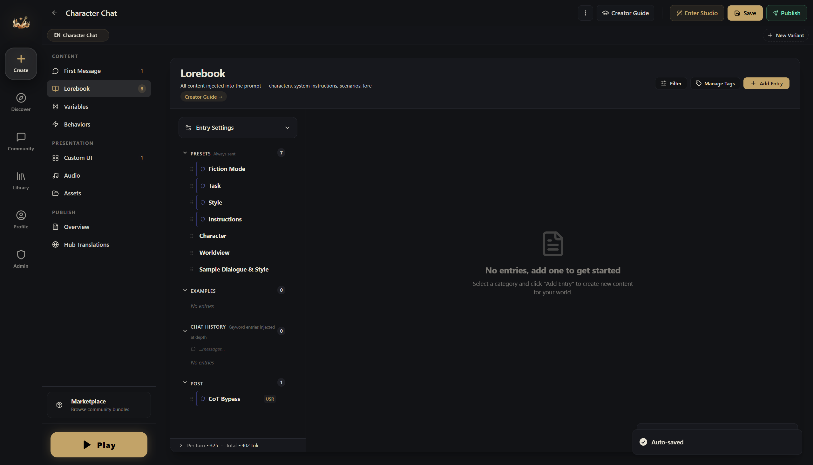
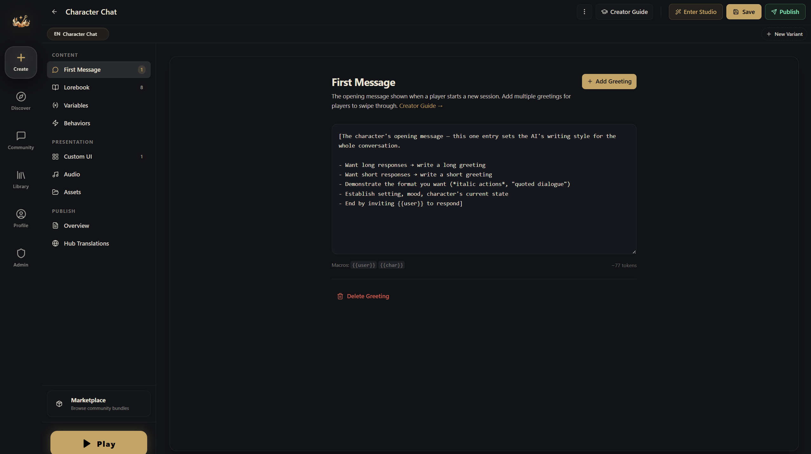
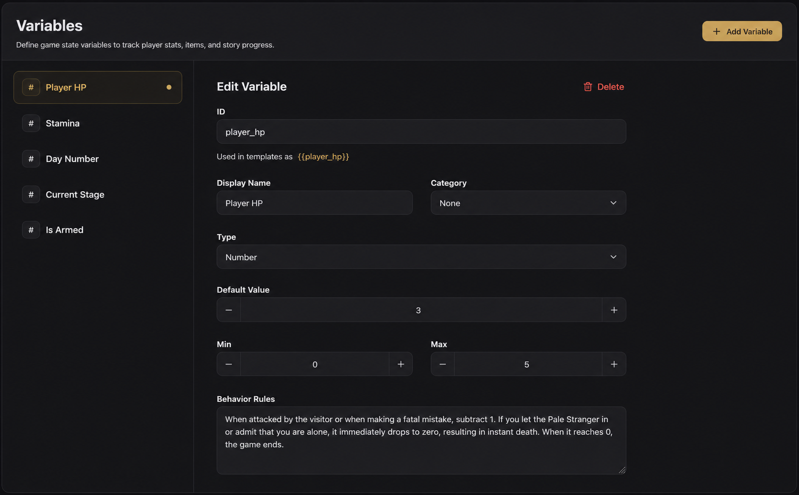
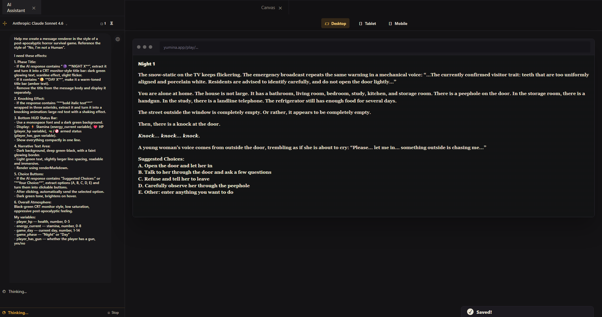
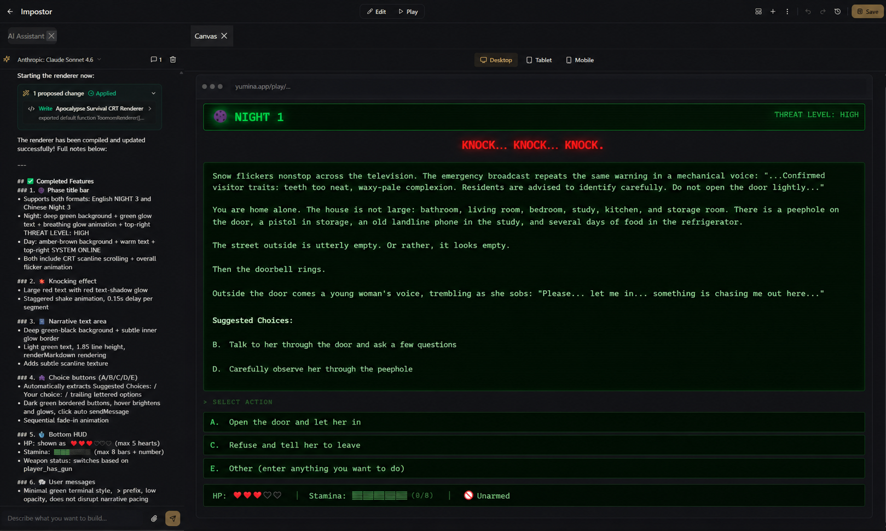

# Step-by-Step Tutorial: Build a Survival Horror World from Scratch

::: tip
This tutorial uses the canvas moves from [Canvas basics](/creator/canvas): clicking rows open, the **Add** row at the bottom of the card, and **Play** in the top bar. Do that page first if you haven't.
:::


We're going to build a horror survival game inspired by **"No, I'm not a Human"**. The premise is simple: the apocalypse has arrived, and outside there are "Visitors" disguised as humans. You're alone at home, and every night someone comes knocking. Peer through the peephole to judge whether they're human or monster, make your choice, and survive 14 nights.

Along the way you'll use lore, variables, an AI-written interface and keyword lore.

---

## Step 1: Create a new world

Click **Create** on the left, choose **Blank Project**, and pick **Canvas**. Then type the name into the name field at the top left, next to the **Canvas** switch:

- **Name**: `The Imposters`

---

## Step 2: Write the character setup entry

In this game, the AI isn't playing a character — it's acting as the **Game Master (GM)**, responsible for narrating scenes, playing all NPCs, and driving the story forward. So the first entry tells the AI its role and responsibilities.

Click the row under **Character and world** to open it.



| Field | Value |
|-------|-------|
| **Name** | `Game Master Setup` |
| **Send as** | `Instruction` (the default; the AI treats this as a rule to follow) |

In the **Content** field, write:

```
You are a fair and impartial horror survival game GM. The game lasts 14 days (14 nights).

Setting: The apocalypse has begun. The city is overrun with "Visitors" — entities that look exactly like humans. The player is alone at home. Every night, someone knocks on the door asking for help. The player must observe through the peephole, talk through the door, and use various methods to judge whether the visitor is human or a monster, then decide whether to open the door.

Your responsibilities:
- Each night, describe the knocker's appearance and behavior
- Give clues fairly without directly revealing their identity
- During the day, let the player freely explore the apartment, use items, and make phone calls
- Maintain a suspenseful and tense atmosphere
- At the end of each reply, provide 3–5 suggested options (in A/B/C/D/E format)

Begin each reply with a phase header:
- Night: 🌑 **NIGHT X**
- Day: ☀️ **DAY X**
```

A few key points:
- This entry is in **Character and world** → it's sent to the AI every turn. Core settings must go here
- **Send as = Instruction** → the AI treats this as a system directive, not character dialogue. You'll find **Send as** under **When the AI sees this** → **Advanced**, but there's nothing to change

---

## Step 3: Write the opening message

Click the box under the opening (**Greeting**) and write:



```
🌑 **NIGHT 1**

The television screen flickers with static. An emergency broadcast drones on in a mechanical voice, repeating the same warning: "…Currently confirmed Visitor characteristics: teeth that are unnaturally uniform and porcelain white. Residents are advised to exercise caution and avoid opening doors to unknown individuals…"

You're alone in the apartment. It's a modest place — bathroom, living room, bedroom, study, kitchen, and a storage room. There's a peephole on the front door. The storage room has a handgun. The study has a landline telephone. The fridge has a few days' worth of food.

Outside the window, the street is deserted. Or at least — it looks that way.

Then comes the knocking.

***Knock… knock… knock.***

A young woman's voice drifts through the door, trembling and tearful: "Please… let me in… there's something out here chasing me…"

**Suggested choices:**
A. Open the door and let her in
B. Talk to her through the door and ask a few questions
C. Refuse and tell her to leave
D. Look through the peephole to observe her carefully
E. Other (type any action you want to take)
```

The key elements of a good opening:
1. Immediately tells the player where they are and what's going on
2. Spells out what resources and environment are available
3. Ends with a decision that forces the player into action right away

---

## Step 4: Create game variables

Click **＋ Variable** in the **Add** row at the bottom of the card. Do this 5 times, once per variable below. For each one, change the name at the top, pick the **Type**, set **Starts at** and the **Range**, and write the **Behavior Rules**.

The **ID** is what the interface code in Step 6 uses to read the variable. New variables get a random ID, so open **Advanced** at the bottom of the variable's settings, type the ID from the table, and click **Apply**.



### 1. Health

| Field | Value |
|-------|-------|
| **Name** | `Player HP` |
| **Type** | `Number` |
| **Starts at** | `3` |
| **Range** | `0` to `5` |
| **Behavior Rules** | `Decrease by 1 when the player is attacked by a Visitor or makes a fatal mistake. Drop directly to zero if the player lets the Pale Stranger inside or admits to being alone. Game over at 0.` |
| **ID** (under Advanced) | `player_hp` |

### 2. Energy

| Field | Value |
|-------|-------|
| **Name** | `Energy` |
| **Type** | `Number` |
| **Starts at** | `3` |
| **Range** | `0` to `8` |
| **Behavior Rules** | `Body-checking a visitor and shooting both cost 1 point. Peephole observation and talking are free. Restore to max during the day. Cannot perform energy-consuming actions when energy is 0.` |
| **ID** (under Advanced) | `energy_current` |

### 3. Day count

| Field | Value |
|-------|-------|
| **Name** | `Game Day` |
| **Type** | `Number` |
| **Starts at** | `1` |
| **Range** | `1` to `14` |
| **Behavior Rules** | `Increase by 1 after each complete night-day cycle. The game concludes when Day 14 ends.` |
| **ID** (under Advanced) | `game_day` |

### 4. Phase

| Field | Value |
|-------|-------|
| **Name** | `Game Phase` |
| **Type** | `Text` |
| **Starts at** | `Night` |
| **Allowed values** | `Night`, `Day` |
| **Behavior Rules** | `Value is "Night" or "Day". Night is for handling door-knocking events; Day is for freely exploring rooms and using items.` |
| **ID** (under Advanced) | `game_phase` |

### 5. Armed status

| Field | Value |
|-------|-------|
| **Name** | `Has Gun` |
| **Type** | `Switch` |
| **Starts at** | on (`true`) |
| **Behavior Rules** | `Player starts with a handgun. Shooting a visitor costs 1 energy but may accidentally harm a human. Describe the consequences after a shooting.` |
| **ID** (under Advanced) | `player_has_gun` |

::: tip What are Behavior Rules?
**Behavior Rules** aren't code — they're natural language instructions written for the AI. They tell it when to update which variable. Think of it as a "cheat sheet" for the AI φ(>ω<*)
:::

---

## Step 5: How variables actually change

Every variable you just made has **Precise tracking** switched on. New Number and Switch variables start with it on, and a Text variable gets it once it has **Allowed values**. You'll see a little "precise" tag on each row.

With Precise tracking on, the AI writing the story doesn't change these values itself. After every reply, a small helper rereads the scene, checks it against your **Behavior Rules**, and decides whether each value should change and by how much. Numbers move at most by **Most it can fall per turn** / **Most it can rise per turn**. Those start at 10, which is more than this game needs. Set **Game Day** to rise by at most `1` per turn, and leave the rest.

**So the clearer you write the behavior rules, the better the tracking works.** Go back and review the rules you wrote in Step 4. Make sure every variable clearly specifies "when does it change, and how."

If you switch Precise tracking off for a variable, the story AI changes it instead, by writing a short directive at the end of its reply. The engine teaches the AI that format by itself.

::: tip What do directives look like in the AI's output?
At the end of the AI's reply you'll see something like:

```
[player_hp: -1]
[energy_current: -1]
```

These are the directives. The engine automatically extracts and applies them, and they never appear in the reply the player sees.
:::

::: info More directive syntax
Besides `+` (add) and `-` (subtract), there's also `set` (set to a specific value), `toggle` (flip a boolean), and more. See → [AI Directives & Macros](./directives-macros.md)
:::

---

## Step 6: Make it look great — AI-generated interface

At this point your world is playable. But all the player sees is plain text. Let's build an interface with a real horror game feel, and let the AI write the code.

### Method 1: Use the Creation assistant (recommended)

1. Click **Creation assistant** on the right of the second row of the top bar
2. Make sure the mode under the input box is **Build**
3. Send it the following (you can copy this directly):

```
Rewrite the root component (index.tsx) as a post-apocalyptic horror survival UI.
Reference the style of "No, I'm not a Human".
Keep the outer shell as `<Chat renderBubble={(msg) => ...} />` — let the platform continue to
handle the input box, streaming cursor, and swipes; we only take over the bubble style.

I need these effects:

1. Phase title:
   - If the AI reply contains "🌑 **NIGHT X**", extract it and render as a CRT monitor-style title bar
     (dark green glowing text, scanline effect, subtle flicker)
   - If it contains "☀️ **DAY X**", render as a warm-toned title bar (amber text)
   - Remove the title from the message body — display it separately

2. Knocking effect:
   - If the reply contains ***bold italic text*** (triple asterisks), extract it and render as
     a knocking animation — large red text with a shaking effect

3. Bottom HUD status bar:
   - Monospace font, dark green background
   - Display: ⚡ Energy (energy_current variable), ❤️ HP (player_hp variable),
     🔫/🚫 armed status (player_has_gun variable)
   - Compact single-line display

4. Narrative text area:
   - Dark background (deep green-black), subtle border glow
   - Light green text, generous line spacing for readability
   - Rendered with renderMarkdown

5. Choice buttons:
   - If the AI reply contains "Suggested Choices:" or "**Your choices:**", extract the options
     (A. B. C. D. E.) and render as clickable buttons
   - Click to automatically send the corresponding option
   - Dark green tones, brighter on hover

6. Overall vibe: black-green CRT monitor aesthetic, low saturation, oppressive end-of-world feel

My variables:
- player_hp — health, number, 0–5
- energy_current — energy, number, 0–8
- game_day — current day, number, 1–14
- game_phase — "Night" or "Day"
- player_has_gun — whether armed, true/false
```

4. The assistant writes the code into **Panels → Front End Code**. Click **Player interface** in the middle of the top bar to see the result
5. Want changes? Keep talking — "make the knocking effect more dramatic" or "the choice buttons are too spread out". If a round goes wrong, click **Undo this turn** in **The assistant's last turn** strip at the bottom of the canvas





### Method 2: Use an external AI (Claude, ChatGPT, etc.)

If you'd rather use another AI, there are two ways.

**Connect it to your card.** Click **Connect your AI** in the top bar and follow the steps. Once connected, your AI edits the card directly, and you can send it the request above as is. See [Connect your own AI](/creator/studio-ai#connect-your-own-ai).

**Paste the code yourself.** Send the effect description above along with the Yumina technical info appended at the end:

```
Yumina technical info (please follow these rules when writing code):
- Root component: export `export default function MyWorld() { return <Chat renderBubble={(msg) => ...} /> }`
- `<Chat />` is the platform-provided chat building block — it handles the input box, message
  list, streaming cursor; we only customize each bubble via renderBubble
- Inside renderBubble, the msg object exposes: `contentHtml` (pre-rendered HTML), `rawContent`
  (raw text), `role` ("user" / "assistant"), `messageIndex`, `isStreaming`,
  `renderMarkdown(text)` (turns markdown into formatted HTML)
- useYumina() gives you variables, e.g. useYumina().variables.player_hp
- useYumina().sendMessage(text) sends a message as the player (for clickable options)
- Built-in Icons library (no import), e.g. Icons.Heart, Icons.Zap
- Tailwind CSS and React hooks supported
- Inject animations with useEffect + document.createElement("style")
- React, Chat, useYumina, Icons are all globally available in the sandbox — no imports needed
```

Once you have the code:
1. Open **Panels → Front End Code** and select `index.tsx`
2. Paste the code in (replace the default `return <Chat />`)
3. If the panel shows **OK**, you're done

::: tip You don't need to understand the code
As long as the panel shows **OK** after pasting, it's working. If it shows **Error**, send the error message back to the AI verbatim and ask it to fix it.
:::

::: tip What if the result isn't what you wanted?
Tell the AI directly: "the health bar is too thin, make it thicker," "change the background to pure black," "add a flickering effect." A few iterations usually get it there.
:::

---

## Step 7: Write keyword lore

The setup entry from Step 2 is sent every turn. Some information only needs to reach the AI when it's relevant, and that's what **keyword lore** is for.

Click the **＋** in the top right of the **Character and world** block to add a new entry. Open it, then open **When the AI sees this**: untick **Always Send** and type the keywords into **Keywords**. The entry moves into the **Keyword lore** block. Make these three:

### 1. Door-knocking rules

| Field | Value |
|-------|-------|
| **Name** | `Knocking Event` |
| **Send as** | `Instruction` |
| **Keywords** | `door`, `knock`, `open`, `knocking` |

```
Door-knocking event rules:
- Each night has 2–3 visitors, appearing one by one
- Player options: observe through peephole (free), talk through the door (free), request a body check (costs energy), open or refuse
- Letting a human in = may provide help | Letting a Visitor in = dangerous
- Keep descriptions suspenseful when portraying knock scenes — never directly reveal identity
```

### 2. Peephole observation

| Field | Value |
|-------|-------|
| **Name** | `Peephole Observation` |
| **Send as** | `Instruction` |
| **Keywords** | `peephole`, `peek`, `observe`, `look` |

```
Peephole observation rules:
- Can only see the visitor's head and upper body
- Focus descriptions on: facial expression, teeth, eyes, skin texture
- Visitors' disguises have subtle flaws (unnaturally uniform teeth, abnormal pupils, strange skin texture)
- Humans have normal imperfections (cavities, dark circles, scars)
- Never directly reveal identity — describe only what is seen
```

### 3. Room search

| Field | Value |
|-------|-------|
| **Name** | `Room Search` |
| **Send as** | `Instruction` |
| **Keywords** | `search`, `check`, `rummage`, `explore`, `room` |

```
Room search rules (daytime only):
- Storage room: can find the handgun
- Kitchen: food supplies, can restore a small amount of energy
- Study: telephone, can call for information
- Describe environmental details to build unease
```

::: tip How keyword triggering works
Before each AI response, the engine scans recent messages. If a matching keyword appears → the corresponding entry is sent to the AI for that turn. If nobody mentioned it → the AI doesn't see it, and no token budget is spent on it.

How many recent messages are scanned is the **Keyword scan depth**: click **Context** at the bottom of the card and open **Advanced**. The default is 2; for this game, 4 works better.
:::

---

## Step 8: Test it

Click **Play** on the right of the top bar. A playtest starts a real game with the model you picked, so it uses credits. Play a few turns and check the following. **This turn** on the right shows what happened behind each one.

| Check item | How to verify | If it's not working |
|-----------|---------------|---------------------|
| Opening message appears | First message shows automatically on entry | Check that the opening (Greeting) has text |
| Custom UI is active | Messages have a CRT-style phase title and HUD | Check that `index.tsx` in **Panels → Front End Code** has the renderBubble code and shows **OK** |
| Values change | HUD values update after interactions; **Each value** in This turn says why a value changed or didn't | Check that each variable's Behavior Rules are clearly written |
| Keyword lore triggers | Mentioning "peephole" makes the AI follow the rules; **What the AI got** lists it under lore mentioned this turn | Check keyword spelling and the Keyword scan depth |

When you're done, click **Stop** to go back to the canvas.

---

## Step 9: Fill in the card details

Click **Cover & blurb** on the right of the canvas. **Card settings** opens:

1. Upload a **Cover Image** (something that conveys the horror atmosphere). You need a portrait **Phone · 2:3** and a landscape **Desktop · 16:9** version
2. Write a **Description** so players know what they're getting into
3. Set **Language**: choose the language your world is written in (e.g., `English`)
4. Click **Save** in the top bar


---

## Step 10: Publish

1. Click **Not live** on the right of the top bar. It runs through a short checklist: a name, a cover, an opening, and at least one playtest
2. Click **Publish**. In the dialog, add **Tags** (`horror`, `survival`, `mystery`, `interactive fiction`), set the **Content Mode** (**Limited** or **Limitless**), visibility, and whether others may make editable copies
3. Confirm your rights to the content and click **Publish**

Your world goes into review. Once it passes, players can find it on Discover ヽ(✿ﾟ▽ﾟ)ノ

---

## What you've learned

| Concept | What you did |
|---------|-------------|
| **Lore** | Wrote the GM setup and an opening message, the foundation of AI behavior |
| **Variables** | Created HP, energy, day counter, phase and armed status, tracked precisely after every reply |
| **Behavior Rules** | Told the tracking (or the AI) in plain words when each value changes |
| **Interface** | Had the AI generate a CRT-style interface, no code written yourself |
| **Keyword lore** | Rule entries that only reach the AI when they're mentioned |

## What else you can do

- **[Behaviors](./rules-deep.md)** — auto-trigger a death ending when HP hits 0, no need to rely on the AI remembering
- **[Custom UI Guide](./custom-ui-deep.md)** — turn messages into speech bubbles, visual novel scenes, or battle logs
- **[Audio](./audio-deep.md)** — add BGM and sound effects, auto-switch to creepy music when entering the basement
- **[Conditional lore](./entries-deep.md)** — send lore based on variable values, like late-game plot reveals

---

Head to [yumina.io](https://yumina.io) and search for **"No, I'm not a Human"** to play the full version.
