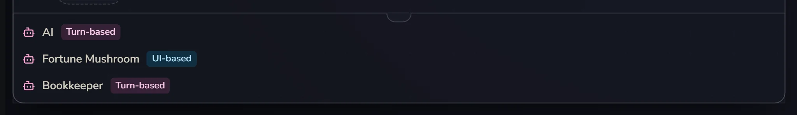
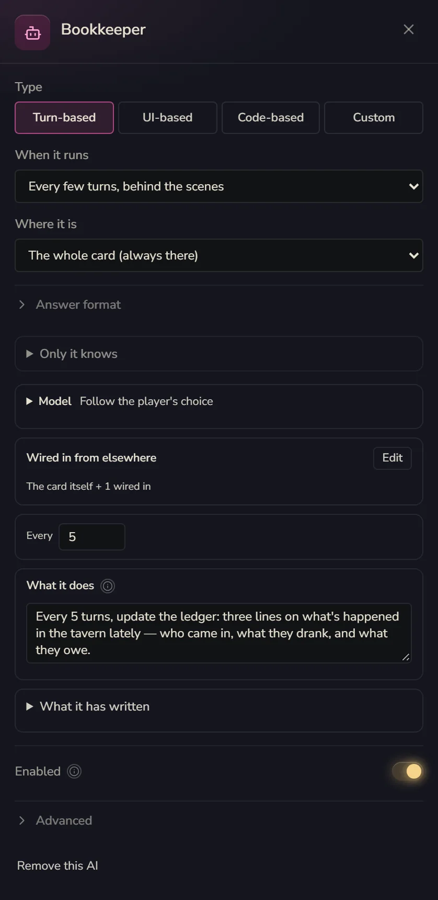
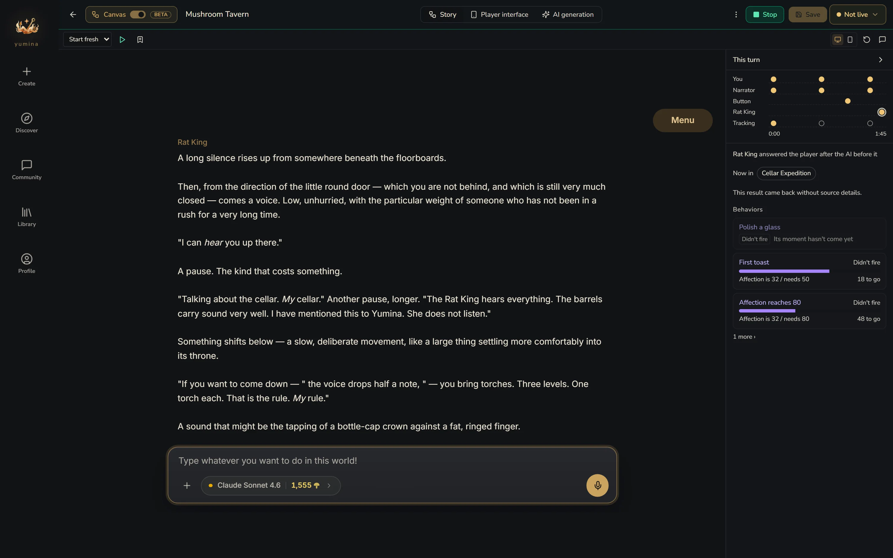
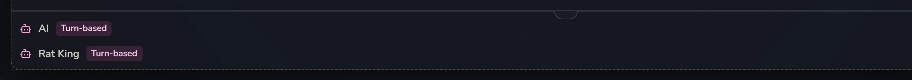
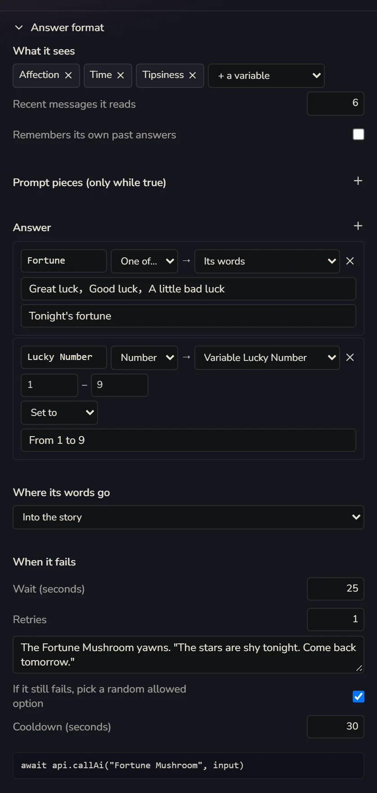

# AIs

Every card comes with one AI, called the **Narrator**: the player says something, it answers. For the vast majority of cards, that's all you need.

Sometimes you'll want more, though. A talking Rat King in the cellar who should have a temper of his own. A fortune-telling mushroom in the tavern who reads your luck when the player presses a button. A little bookkeeping sprite who tidies the ledger behind the scenes every five turns and never says a word to the player. Each of these is one more AI.

**Every extra AI means one more model call each time, which costs more credits.** Before adding one, think about whether it really needs to be its own AI. Often one more lore entry does the job.

## Where an AI lives

At the very bottom of the card and of every scenario is an **AI** row, one line per AI, showing its name and type. Where an AI lives is where it works:

- Living **on the card**: always there
- Living **in a scenario**: only there while that scenario is open
- **Not placed (off)**: not active, just parked

What it knows depends on where it lives, too. On the card, it reads the card's lore. In a scenario, it reads the card's plus that scenario's. If you want some entries that only this one AI knows and no other AI does, put them in **Only it knows** in its settings.

You can drag an AI row straight onto another scenario or onto the card. That moves it.

## Add an AI

**Add → An AI call**. It's added to whichever scenario you're looking at (or the card, if no scenario is selected), and its settings open on the right at the same time. The first thing at the top is choosing what kind of AI it is. To change it later, click its row and the settings open again.

## Four kinds of AI

| Type | When it runs |
|---|---|
| **Turn-based** | Runs with the player's turns: it answers every time the player speaks, or runs behind the scenes every few turns, or waits for another AI to reply first |
| **UI-based** | Waits for a button in the player interface to call it |
| **Code-based** | Picks its own moment: when a value meets a condition, when a scenario ends, after a quiet spell |
| **Custom** | The kind a form can't build. You hold its place on the canvas and code makes it work (see below) |

Fine-tune it under **When it runs** in its settings:

- **Every time the player speaks, it replies**: the ordinary Narrator kind
- **Every few turns, behind the scenes**: never talks to the player. Good for writing summaries and keeping the books
- **Right after another AI replies**: waits for the AI you pick to finish, then runs. For example, the Narrator tells the story and a sidekick chimes in with a wisecrack
- **Call it from a button in the Player interface**: once it's set up, go to the player interface and give a button a **Call an AI** step
- **When a value meets a condition**: runs once the moment the condition goes from false to true. If it just stays true, it doesn't keep running
- **When a scenario ends**: the dungeon's done, it reads through it and writes something for the next place to read. This is the most common timing for behind-the-scenes AIs
- **After a quiet spell, it may cut in**: if the player has the game open and nobody has said anything for that many seconds, it decides for itself whether to say something. With nothing to say it stays quiet, but every time it decides still counts as a call

## Custom: leaving a spot for code

Some AIs can't be set up with a form: two characters on stage, each with rules only code can handle, or a director who only speaks up after watching what happens in the room. For those, pick **Custom**.

Once picked, the AI is a placeholder. It has a name, lives in a scenario, and gets to read that scenario's lore, but it won't run by itself. Who makes it run? Whoever writes the code. You don't need to know how. Stick a note on it saying what it should do, and the Creation assistant, or an outside AI you've hooked up with "Connect your AI", will come and write it.

Once it's written, click its row to see which file and line implement it. If nothing's written yet, it's empty and says "not implemented yet".

## Group chat

When two or more AIs that answer the player are in the same place, you get a **Group chat · they answer in turn**: the player says something, and they reply one after another, each in their own bubble, with the speaker's name on it.

- **On the card**: the Narrator goes first, then the card's other AIs follow in turn
- **In a scenario**: when a scenario has its own AIs, by default they speak instead of the Narrator. The Narrator's row fades, and on the right there's a **Card's AI too** button. Click it and the Narrator stays to talk along with them. While the Narrator is there, the button changes to **Card's AI out**. Click that to have the Narrator step aside

When the player regenerates, the later speakers in a group chat are redone by the same AI too, so nobody ends up with someone else's lines.

## What it remembers

Every AI's settings have a memory part and a "wired in" part:

- **Remembers the whole conversation**, **remembers only what was said here**, **shares memory with** someone: the same system as [scenario memory](/creator/modules#memory)
- **Recent messages it reads**: a combat AI might only need the last 10, for example. Cheaper, and less likely to get sidetracked by small talk from three hundred turns ago
- **＋ Wire one in**: hands it something from somewhere else to read. You can wire in a scenario's history, something a behind-the-scenes AI wrote, a scenario's variables, or a scenario's raw messages. Wired-in history can count as **Lived it** (something the main character went through) or **Archive** (records they found, not lived through). Raw messages are expensive, so use history whenever you can

This is how what a behind-the-scenes AI writes gets handed to other AIs. On the canvas this shows up as "writes for …" and "gets what … writes".

**UI-based** AIs and the ones that **cut in after a quiet spell** don't have a "wired in" part. Everything a UI-based AI sees is chosen under **What it sees** in **Answer format** below. The one that cuts in when things go quiet reads the recent conversation by itself.

## Model

**Model** defaults to **Follow the player's choice**. You can also give a particular AI its own, like a chattier model for the Rat King. If the player can't use the model you picked, it falls back to the one they chose, so the card never gets stuck.

## Answer format: getting a tidy answer

In an AI's settings, under **Where it is**, there's a folded section called **Answer format**. Most of the time you won't need it, but it's great for building minigames.

Take the "Fortune Mushroom" in the tavern: when the player presses the button, it has to answer two things, a **Fortune** (only Great luck / Good luck / A little bad luck) and a **Lucky Number** (1 to 9). The fortune is said to the player. The lucky number goes into a variable.

- **What it sees**: pick a few variables to show it, how many recent messages it reads, and whether it **Remembers its own past answers**
- **Prompt pieces (only while true)**: like "When Tipsiness ≥ 5, add: The Fortune Mushroom has had too much tonight and talks in circles"
- **Answer**: by default it just answers with text. Add fields and it answers in JSON. Pick a type for each field (Text / Number / One of… / List), then where it goes: **Its words**, **Variable** (set to / add / append to a list), **A story event**, or **Only returned**
- **Where its words go**: **Into the story** (default), **Only back to the interface**, **An interface channel**
- **When it fails**: how many seconds to wait at most, how many retries, how many seconds of cooldown, and a few backup lines (one is picked at random). Tick **If it still fails, pick a random allowed option**, and a "One of…" field still gets a valid answer even when the model goes on strike

What comes back from the model gets checked: a "One of…" answer has to be one of the options, numbers are clamped into range. If something's off, it asks once more with a hint. If that still fails, it uses a backup line.

If you code, your card's interface code can call it directly with `api.callAi("Fortune Mushroom", input)` and get back `{ text, fields }`. Details in [Advanced: API Reference](/creator/advanced/08-api-reference).

## AI table

When a card has more than one AI, **View → AI table** shows one big table: for every lore entry and every variable, which AI can see it and which AI can change it. With lots of AIs it's easy to lose track, and this table helps you make sure the Rat King doesn't know things he shouldn't.

## When the wiring doesn't work

If an AI's settings aren't complete, the canvas tells you what's wrong under **This wiring cannot work**. For example:

- "When it runs" isn't picked, so it will never run
- A behind-the-scenes AI has nothing wired in, so anything it writes is made up, and it still costs money
- The AI it's waiting for never replies to the player, so it'll wait forever

Just follow the hints. When you're done, remember to [playtest](/creator/playtest). In the playtest timeline every AI gets its own lane, so you can see who spoke and who was woken up but stayed silent.
