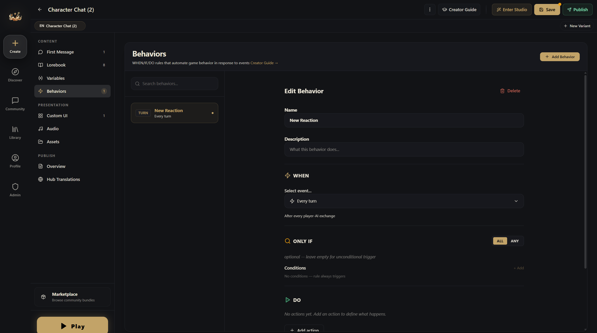

# Behaviors

Event-driven triggers that fire without the AI's involvement. They handle the things that need to be precise, consistent, or instant.

In the editor, this is the **Behaviors** section. Different from the Behavior Rules on variables — those teach the AI how to respond; behaviors fire mechanically.

The horror world from earlier doesn't use any behaviors — it runs entirely on entries and Behavior Rules.

## When to Use Automation

**Good cases for automation:**
- Threshold alerts: "Show a warning when health drops below 10"
- Game phase transitions: "When affinity hits 75, switch to romance mode"
- Timed events: "Advance the day/night cycle every 5 turns"

## How Behaviors Work

Every behavior has three parts:

### WHEN — The Trigger

What event fires this rule:

| Trigger | Fires When |
|---------|-----------|
| **Variable crossed** | A variable rises above or drops below a threshold |
| **State changed** | Any variable changes value |
| **Turn complete** | Every N turns (e.g., every 5 turns) |
| **Session start** | The first time a player starts your world |
| **Player keyword** | The player mentions a specific word |
| **AI keyword** | The AI's reply contains a specific word |
| **Every turn** | After every single turn |
| **Action** | A custom UI button calls `api.executeAction(actionId)` |
| **Manual** | No event trigger — fires whenever its conditions are met during an evaluation pass |

### IF — The Conditions (Optional)

Additional checks that must be true before the rule fires:

- Variable equals / not equals / greater than / less than a value
- Multiple conditions combined with AND or OR logic

### THEN — The Actions

What happens when the rule fires:

| Action | What It Does |
|--------|-------------|
| **Modify variable** | Change a variable's value (set, add, subtract, etc.) |
| **Tell the AI** | Inject a one-off directive to the AI |
| **Send context** | Inject a one-off system/user message into the next AI turn (invisible to the player) |
| **Notify player** | Show a toast notification |
| **Play audio** | Trigger a sound effect or music change |
| **Toggle entry** | Enable/disable a lorebook entry |
| **Toggle rule** | Enable/disable another rule |

## Real Example: Dating Sim Route System

**At affinity 25** — a subtle notification: "She seems to have noticed you..."

**At affinity 50** — an achievement toast + the AI gets a new directive: "She's starting to show feelings — describe contradictory behavior, wanting to be close but pulling away."

**At affinity 75** — the climax trigger: the AI gets a directive to write a confession scene, and the story phase shifts to "climax."

## Rule Options

- **Priority**: higher-priority rules fire first (useful when several rules trigger at once)
- **Cooldown**: minimum turns between fires (prevents spam)
- **Max fire count**: the most times this rule can ever fire (1 = a one-shot event)
- **Enabled/disabled**: rules can be toggled by other rules (chain reactions)
