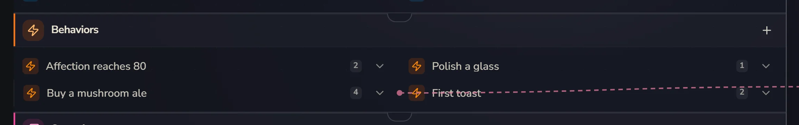
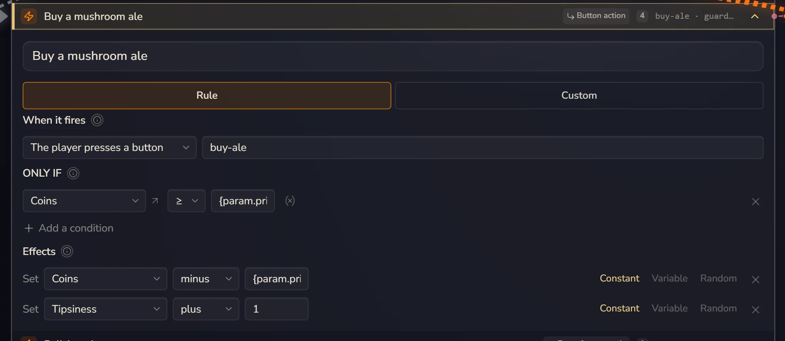
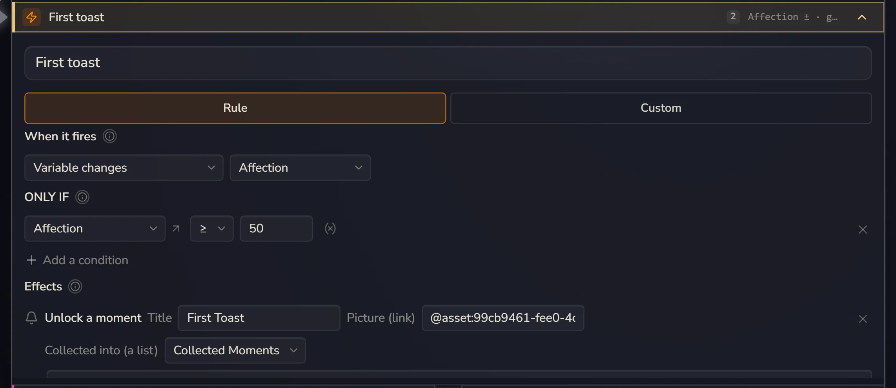

# Behaviors

A behavior is "If this, then that." The engine runs it by itself with no AI involved, so it's reliable: if Yumina's feelings are set to open at affection 80, they open at exactly 80.

This is different from the "Behavior Rules" on a variable. Behavior Rules teach the AI how to change a number. A behavior is the engine doing the work itself.

## When to use a behavior

- Thresholds: "When affection hits 80, open a hidden piece of lore"
- Pacing: "Move time forward every 5 turns"
- Buttons: "When the player buys a drink, take 5 coins"
- One-off surprises: "On the first toast, pop up a picture"

## Add a behavior

Click **＋ Behavior** in the **Add** row at the bottom of the card (or **Add → A behavior**), and the new behavior's settings open right away:

Every behavior has three parts: **When it fires**, **ONLY IF** (optional) and **Effects**. This one is "when affection rises above 80, show the player a note":

The canvas draws that dashed line between Affection and the behavior by itself. It means this behavior is watching this variable.

Once you have lots of behaviors, the block shows them one per row:

### When it fires

| Trigger | When |
|---|---|
| Every turn | After each round of the player and the AI going back and forth |
| Every N turns | At a fixed interval |
| Every N seconds | In real time, only while the player has the game open |
| Session starts | When a new game starts |
| Player says keyword / AI says keyword | When a certain word shows up in a message |
| Variable changes | When a variable's value changes |
| Variable crosses threshold | The moment a number crosses a line, going up or down |
| The player presses a button | A button in the player interface calls it |

### ONLY IF (optional)

A variable equals, is above or is below some value, or compares against another variable. With several conditions, choose **All must hold** or **Any may hold**.

When the conditions don't hold, you can write a line in **If the conditions don't hold, say**, like "Not enough coins — {param.price} needed". Leave it empty and nothing happens, and the player has no idea why the button didn't do anything.

### Effects

Click **Add an effect**. Effects come in a few groups:

| Group | Effect | What it does |
|---|---|---|
| Game | Change variable | Set to, add, subtract, multiply, toggle, append |
| | Enable/disable variable | Make a variable show up or hide |
| | Enable/disable scenario | Open or close a scenario. Scenarios set to "Only the Enabled switch" rely on this |
| AI & Story | Tell the AI | Slip the AI a line the player can't see |
| | Enable lore entry / Disable lore entry | Open or close a piece of lore |
| Audio | Play music / Play sound effect / Stop audio | |
| Player | Show notification | Pop a note up for the player |
| | Unlock a moment | A little card with a picture, see below |
| Advanced | Enable/disable behavior | Switch other behaviors on or off, so you can chain them |

One behavior can have several effects. They run in order.

### Stop condition

At the very bottom is a **Stop condition** box, which you can leave empty. If you fill it in, the behavior doesn't run while the condition holds, and runs again once it no longer does. For example, "stop reminding at affection 100". To have it run only a few times, use **Max fires** under Other options below.

## Passing a value from a button

When a button in the player interface calls a behavior, it can **pass something in** along the way. Say the tavern menu has one button per drink, and they all call the same "Buy a mushroom ale" behavior. Only the **price** they pass in is different:

- On the button: **Set off a behavior** → pick "Buy a mushroom ale" → **+ Pass something in**, name it "price", value `5` (you can also write `{{some_variable}}`)
- On the behavior: condition `Coins ≥ {param.price}`, effect `Coins minus {param.price}`, and if the conditions don't hold, tell the player "Not enough coins — a glass is {param.price}."

One behavior runs the whole menu (๑•̀ㅂ•́)و✧

## Moments

**Unlock a moment** gives the player a little card: a title, a line of text and a picture, like an achievement or a CG unlock in a game. Fill in **Title** and **Picture (link)**, then choose **Collected into (a list)**.

Once a moment is in the list, it won't pop up a second time. Set that list variable to **Kept across playthroughs** (in the variable's settings), and each player only ever unlocks it once, even across new games. CG galleries and multi-ending collections are built on this.

## Code behaviors

If you can write a bit of JavaScript, a behavior's effects can include a piece of **Code** that runs inside the card during play. It can read and write variables, show notes, make the AI speak, call other AIs and roll random numbers. Useful for things like gacha pulls or shuffling a deck, which are awkward to build out of effect rows.

The AI never runs code. Code only runs while the player has the game open.

## Custom behaviors

At the top of a behavior's settings are two buttons: **Rule / Custom**. Rule is everything above: one sentence of when, if, and what to do. Custom is something else: code does the work for this behavior, and the sentence in the form doesn't count.

Pick Custom when the effect you want can't be built from effect rows and you don't want to write code yourself. The behavior then becomes a placeholder. Stick a note on it saying what it should do, and the Creation assistant, or an outside AI you've connected, will come and write it. Once it's written, this spot shows how it's done: how many lines of its own code it has, or which file and line in the player interface fires it. If nothing's written yet, it's empty.

## Example: an affection route

- **Affection 25**: show a note, "She seems to have noticed you…"
- **Affection 50**: unlock the moment "First Toast", and tell the AI "She's starting to show her feelings. She wants to get closer but keeps pulling back without meaning to"
- **Affection 80**: enable the lore entry "Her Feelings", so that standby lore goes to the AI every turn from now on

## Other options

- **Priority**: when several fire at once, which goes first
- **Cooldown**: the minimum number of turns between two firings
- **Max fires**: 1 means one-off
- **Enabled**: you can leave it off until another behavior switches it on, chaining them together

Whether a behavior ran, why it didn't, and how far it is from firing are all visible when you [playtest](/creator/playtest).
