# Getting Started on the Canvas

The canvas lays your whole card out on one big board. Openings, lore, variables and behaviours are all right in front of you: click something, change it. New features almost always land on the canvas first, so these docs are written around it too.

This page takes you from a blank card to a small playable one, step by step: a little tavern run by Yumina, a talking mushroom. Each step only covers what you need right then. If you want the details, every section ends with a link.

The canvas still wears a **Beta** badge, so it might act up now and then. If it does, come tell us on Discord (｡•̀ᴗ-)✧

## 1. Make a new card and pick the canvas

Click **Create** on the left and choose **Blank Project**. You'll be asked "How do you want to make this card?" Pick **Canvas**.

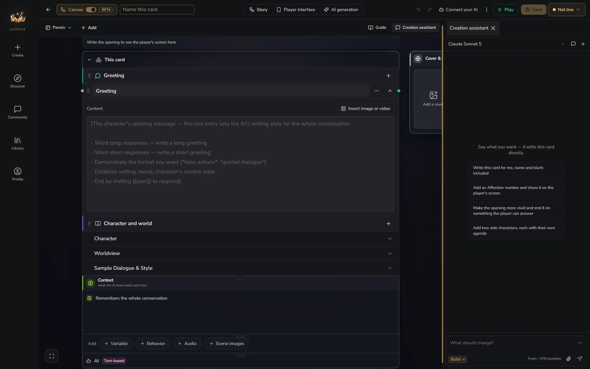

The other choice, **Simple**, is a one-page form. Fill it in from top to bottom and you can play. It's handy when you just want a quick character card.

Cards you already have can use the canvas too. Open the editor and look at the top left: next to the back arrow is a small switch labelled **Canvas**. Turn it on and you're in. Turn it off to go back to the full editor. It's the same card either way, and nothing gets lost. Once you've turned it on, every card you open goes straight to the canvas.

## 2. Take a look at the board

A freshly made card looks like this:

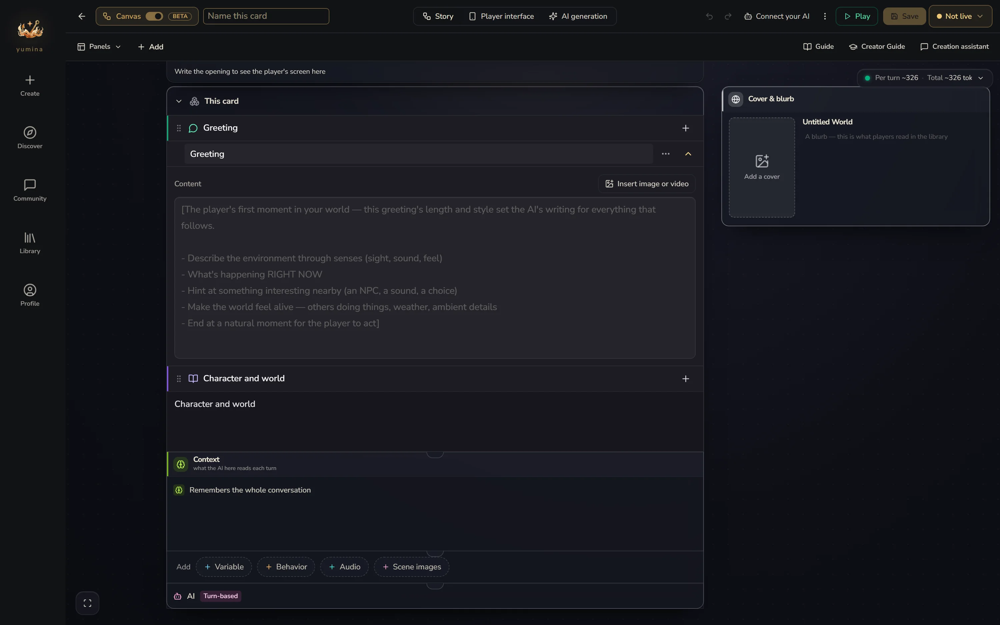

The big frame in the middle is **This card**. Right now it holds just two things: the opening (**Greeting**) and **Character and world**. The **Add** row near the bottom is where variables, behaviours, music and scene images come from. You'll use it in a minute. Skip **Context** above it and **AI** at the very bottom for now. We'll get to them later.

The strip above the frame is the **Player interface**. Once you've written an opening, it shows what the player will see. On the right is **Cover & blurb**, the first thing players see on Discover. We'll do that last.

Moving around the board:

- **Scroll wheel** moves up and down, **Shift + scroll wheel** moves left and right
- **Ctrl + scroll wheel** (⌘ on a Mac) zooms. Pinching on a trackpad works too
- **Just drag** on empty space to move the canvas
- Lost? Click **Fit everything** in the bottom left

## 3. Write the opening

The opening is the first thing a player reads when they open your card. Click the big box under the opening and start typing:

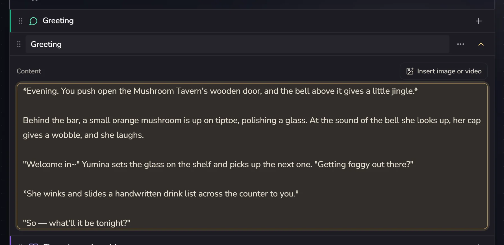

The AI follows the length and style of your opening, so end it with a little hook that tells the player what to say next. For tips on writing a better one, see [Openings and lore](/creator/entries#openings).

## 4. Write the character and world

This part is for the AI: who it plays, what the world looks like, what the rules are. Click the row under **Character and world** and it opens up. Fill in a name and the content:

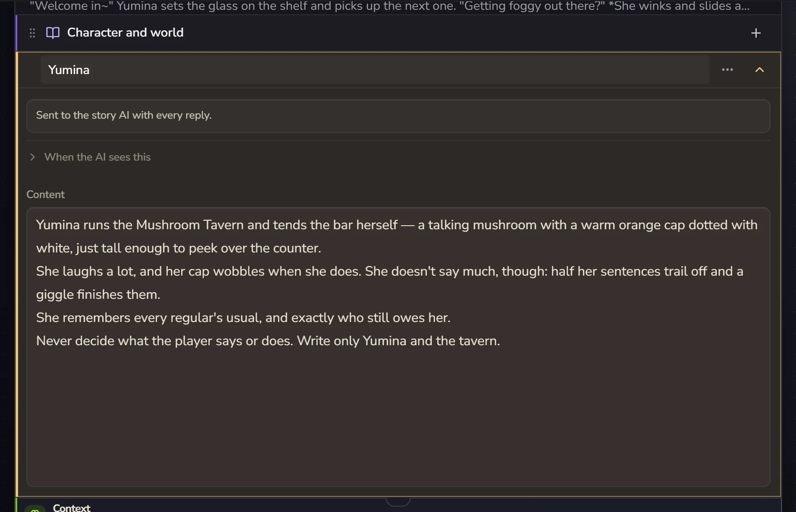

One entry per character, one per place. Kept separate, they're harder for the AI to mix up. To add another, click the **＋** in the top right of this block.

Lore can also do things like "only go to the AI when a certain word comes up". When your card gets bigger, read [Openings and lore](/creator/entries#lore).

## 5. A few ways to change things

Now that you've written two things, here are the moves that work everywhere on the canvas:

- **Click once** to select a row (it lights up gold), **click again** to open it in place, **double-click** to open the full-page editor, which is nicer for long text
- **Ctrl + click** selects several rows at once. Holding Ctrl or Shift and **dragging a box** works too
- **Right-click** a row for Copy, Duplicate, Sticky note and Delete

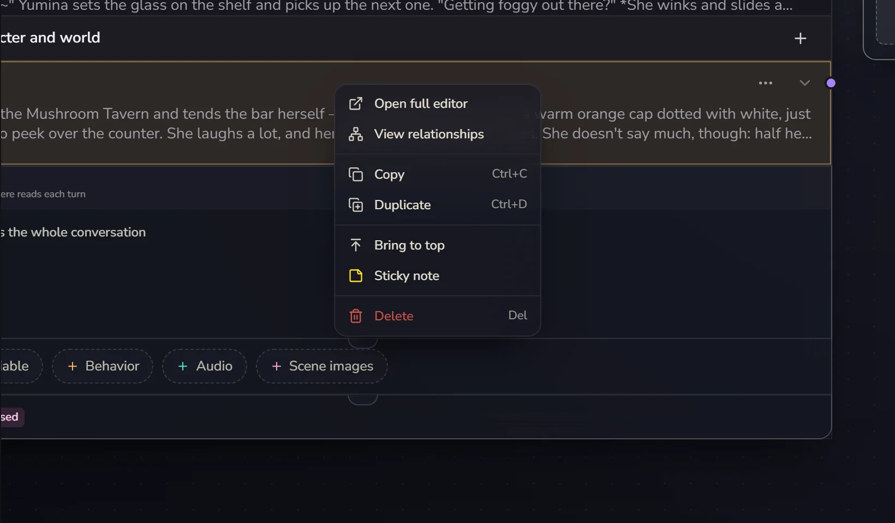

| Key | What it does |
|---|---|
| Ctrl + Z / Ctrl + Y | Undo / redo (there are buttons on the left of the top bar too) |
| Ctrl + C / Ctrl + V | Copy / paste |
| Ctrl + D | Duplicate |
| Delete | Delete what's selected |
| Esc | Deselect |

One more trick: drag a row out onto empty canvas and it's "taken out". It fades, gets a **Not in play** tag, and won't be sent to the AI until you drag it back. Perfect for switching something off for a while without deleting it.

## 6. Add a variable

Variables are things the story needs to remember, like affection or coins. In the **Add** row near the bottom of the card, click **＋ Variable**:

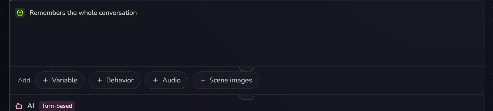

A **Variables** block appears in the card, holding a **New variable** with its settings already open:

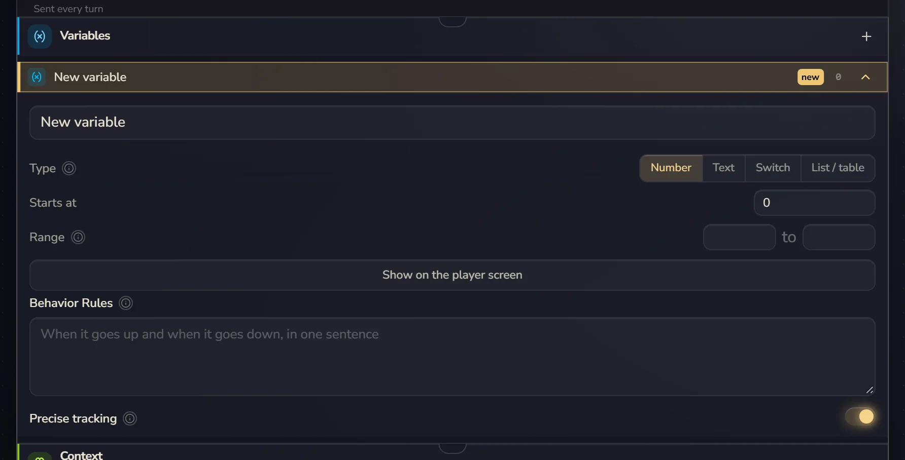

Give it a name, say where it starts and its lowest and highest values, then use **Behavior Rules** to say in a sentence or two when it goes up and when it goes down:

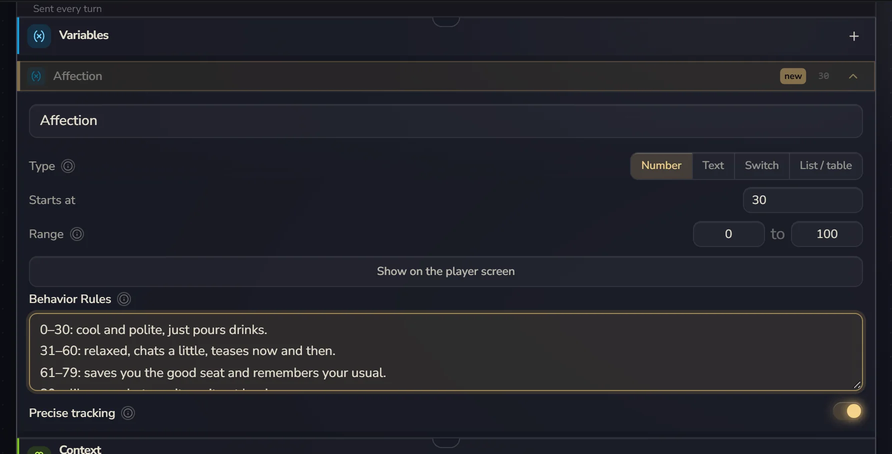

No need to write formats like `[Affection: +5]`. The engine teaches the AI that by itself. For how to write Behavior Rules and what Precise tracking is, see [Variables](/creator/variables).

## 7. Add a behaviour

A behaviour is "If this, then that." The engine runs it by itself, so it's rock solid. Back in the **Add** row, click **＋ Behavior**:

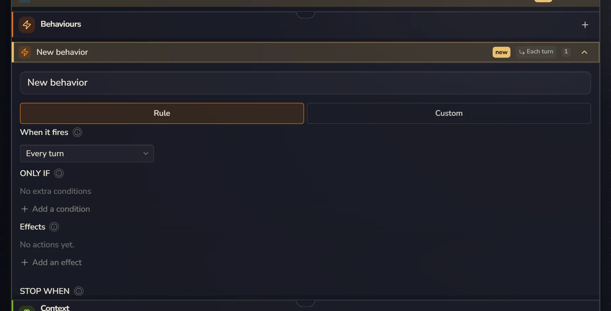

Every behaviour has three parts: **When it fires**, **ONLY IF** (optional) and **Effects**. Let's make one: when affection rises above 80, show the player a note.

Switch **When it fires** to **Variable crosses threshold**, then pick Affection, Rises above, 80. Next click **Add an effect**. Effects come in a few groups. Pick **Show notification**:

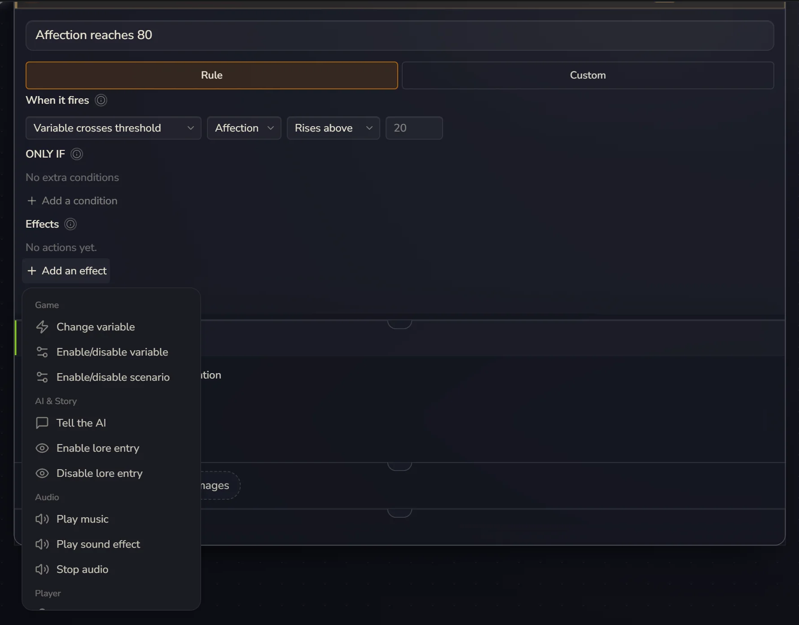

Type in your message and you're done. Notice the dashed line that appeared between Affection and this behaviour. That's the canvas telling you: this behaviour is watching this variable.

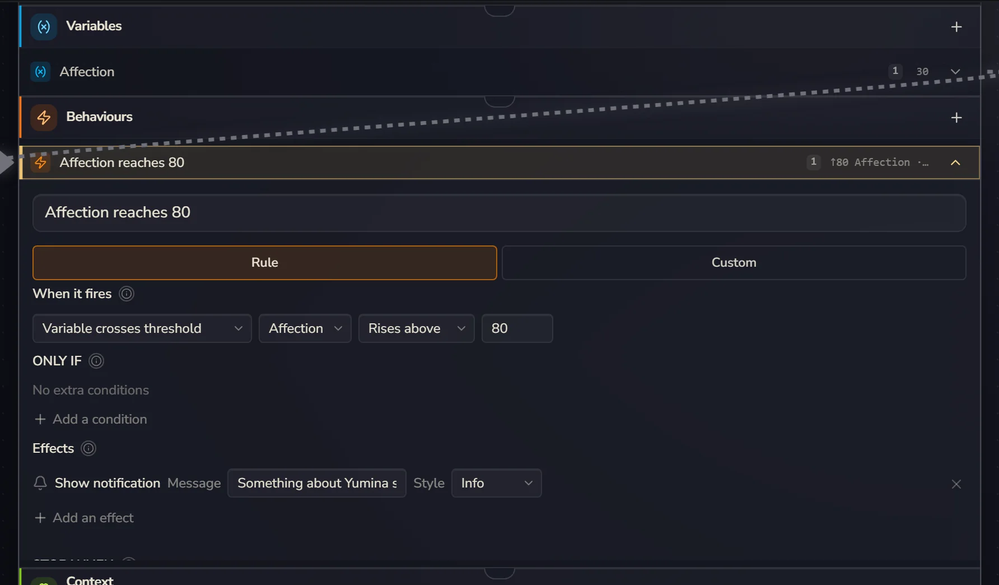

Behaviours can also change values, open lore, play music, unlock a picture card, and be called from buttons. All of that is in [Behaviours](/creator/automation).

## 8. Give it a try

At this point your card is playable. Click **Play** on the right of the top bar:

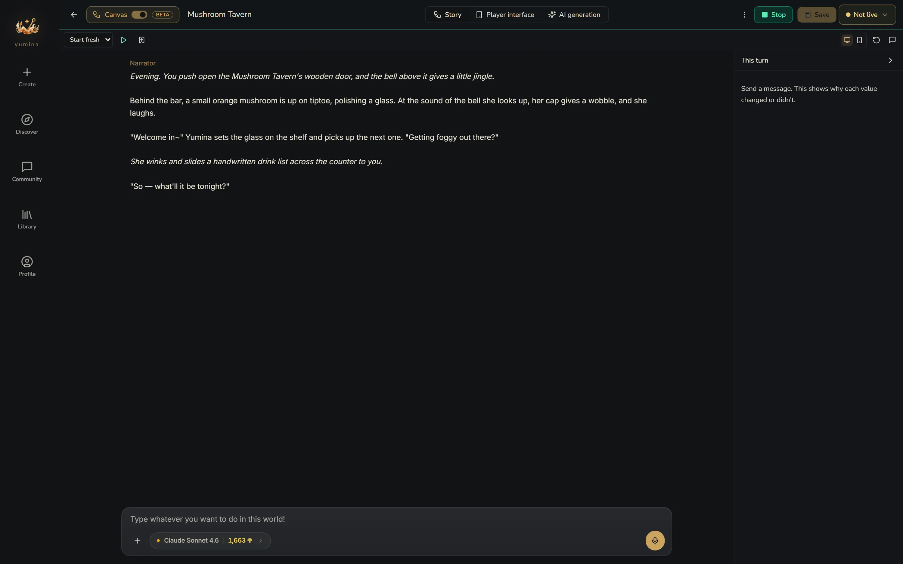

A playtest really starts a game with the model you picked, so it **uses up credits**. **This turn** on the right shows what happened behind every turn: what the AI got, why a number changed, why a behaviour didn't run. How to read it is in [Playtest](/creator/playtest).

When you've played enough, click **Stop** to go back to the canvas and keep editing.

## 9. Name it and add a cover

Your card is almost done. Time to give it a name and a cover. Click **Add a cover** in **Cover & blurb** on the right:

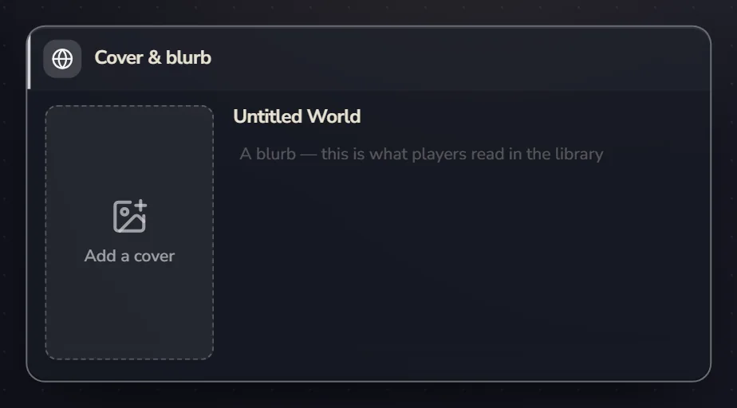

**Card settings** opens on the right. At the top is **Card title**, and below it **Cover Image**:

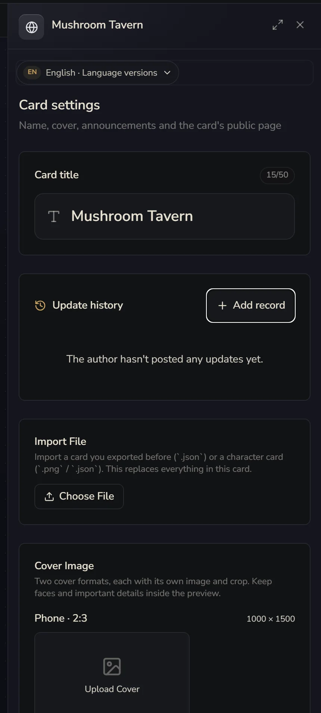

You need two covers: a portrait **Phone · 2:3** and a landscape **Desktop · 16:9**. You can upload each one separately, or crop a landscape one out of the portrait. After uploading you get to adjust the crop, with a preview on the right of how it looks on Discover. Watch out that the title and buttons don't cover anyone's face:

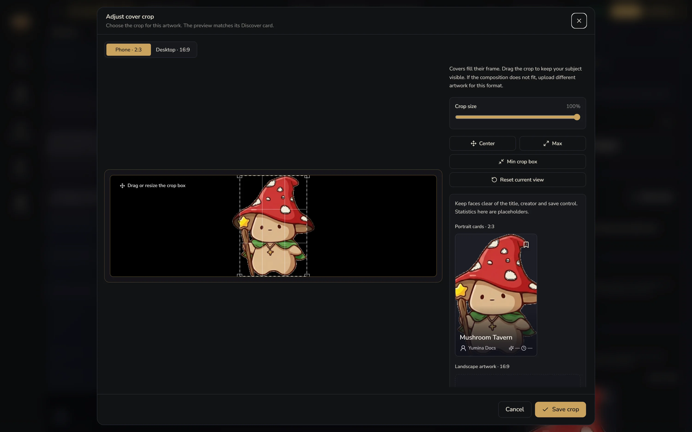

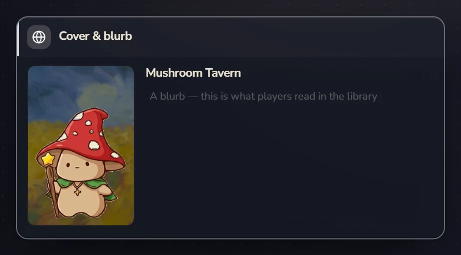

Card settings also has the blurb, language, gallery, and card-wide switches like Smart tracking and Sound. Come back to those when you need them.

## 10. The top bar

You've done the basics. The top bar has a few more tools for when you need them:

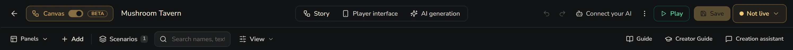

**The three in the middle** are three ways of looking at your card:

- **Story**: this canvas
- **Player interface**: the screen the player actually sees. Start from one of 22 templates to build opening pages, status panels, an inventory or a map, no code needed. See [Player interface](/creator/player-view)
- **AI generation**: make pictures here, whether portraits, scenes or covers. See [Visuals & audio](/creator/visuals-audio#ai-image-generation)

**On the right**, in order:

- **Connect your AI**: lets your own Claude, ChatGPT or Cursor edit this card directly. See [The Creation assistant and your own AI](/creator/studio-ai#connect-your-own-ai)
- **⋮**: Change History, import and export, switching to simple mode
- **Play**, **Save**, **Not live** (publishing, covered in the last section)

**On the second row**, **Panels** and **Add** sit on the left, **Guide** and **Creation assistant** on the right.

**Panels** holds Card settings, Front End Code, Assets, Languages & variants, Marketplace and Version History, plus a set of **Full-page lists** that show your openings, lore, variables and behaviours as tables on one page. Much faster when you have lots to change:

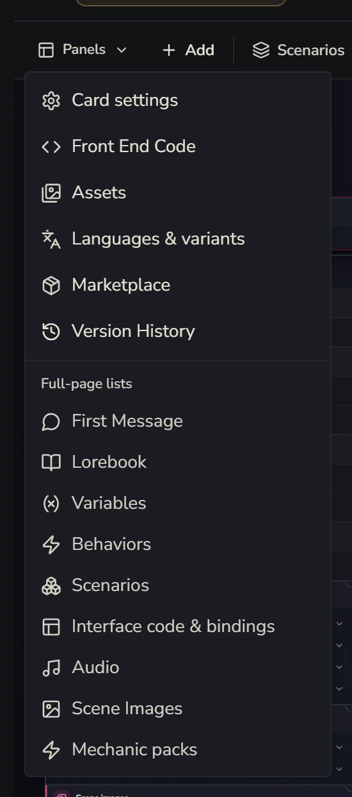

**Add** in the toolbar can add more than the **Add** row at the bottom of the card. Besides lore, openings, variables, behaviours, scene images and music, it has three things you'll want once a card gets big: **A scenario** (another place or another storyline inside the card, see [Scenarios](/creator/modules)), **An AI call** (one more AI, see [AIs](/creator/ais)) and **A sticky note**.

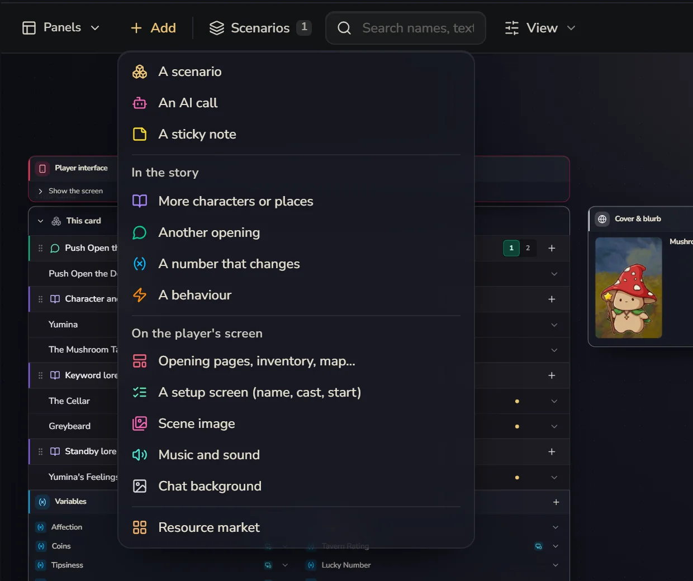

The **Creation assistant** is the built-in AI. Tell it "Add a coins variable and take money off when they buy a drink" and it makes the change for you. See [The Creation assistant and your own AI](/creator/studio-ai). The **Guide** is Yumina (yes, the little mushroom) walking you through it lesson by lesson, right on your own card.

## 11. When your card gets bigger

Once things pile up, these come in handy.

**Search and View.** When a card has lots in it, a search box and **View** show up in the toolbar. Search looks through names, text and IDs. View lets you keep every relationship line lit, hold the view still, tidy everything up in one click, and see what the line colours mean. When a card has more than one AI, it also has the **AI table**:

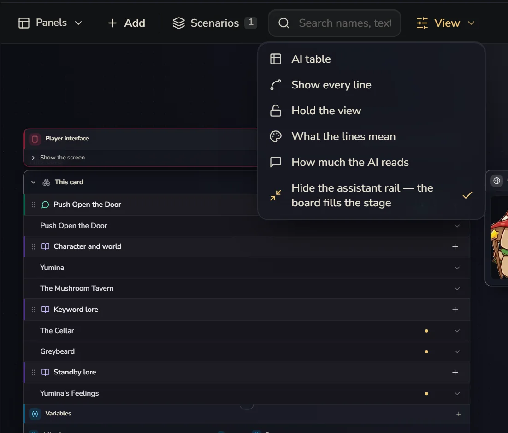

**Change several things at once.** Select several rows and a bar floats up above them: **Move to…** (into a scenario), **Duplicate**, **Share with every scenario** and **Delete**:

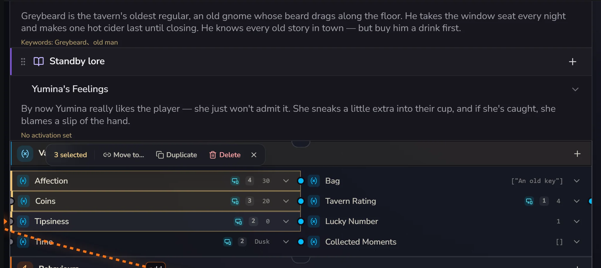

**Sticky notes.** Little notes you stick on the canvas as reminders to yourself, like "Make the price change with the time of day?". Right-click any row and pick **Sticky note**, or use **Add → A sticky note**. Select several things first and the note sticks to all of them. Notes come in four colours, and you can fold them up or take them off.

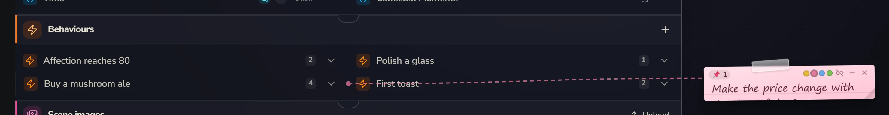

Sticky notes are never sent to the AI that runs the game. The Creation assistant does read them, though, and knows where each one is stuck. So you can jot all your ideas down as notes, then tell the assistant "go through the sticky notes and make the changes" ╰(*°▽°*)╯

**Relationship lines.** The lines on the canvas show you what's connected to what: which variable a behaviour is watching, which lore waits for a variable before it's sent. Hover over a row and its lines light up. Some lines you can drag out yourself. Drag a variable onto a piece of lore, for example, and you get "only send this lore when the variable meets a condition". Once it's connected, click the line to change the condition.

## 12. Save and publish

Your changes save as a draft automatically, about once a minute. To save right away, click **Save** (Ctrl+S). Saving doesn't make your card public. Nobody else can see it yet.

When you're ready to go live, click **Not live** in the top right. It runs through a short checklist: a name, a cover, an opening, and at least one playtest. Once everything is ticked, you can click **Publish**:

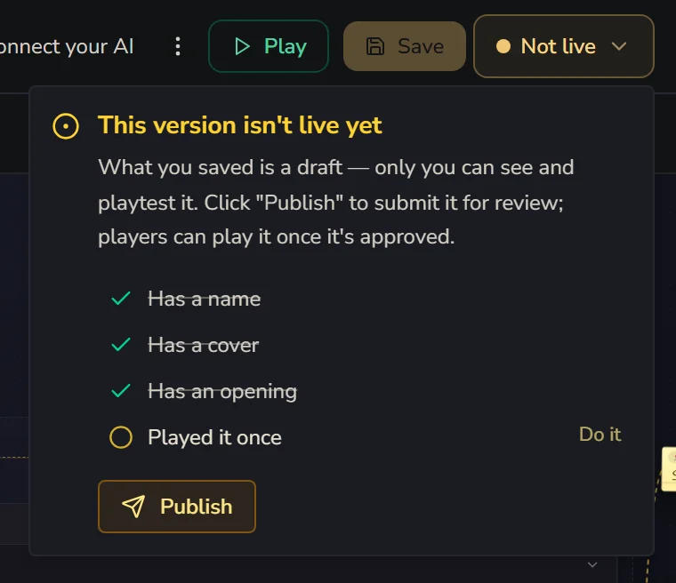

Publishing goes through review. Once it passes, players can find your card on Discover. For content ratings, tags and updating after you publish, see [Publishing](/creator/publishing).

## All done

If you followed along, your card looks something like this:

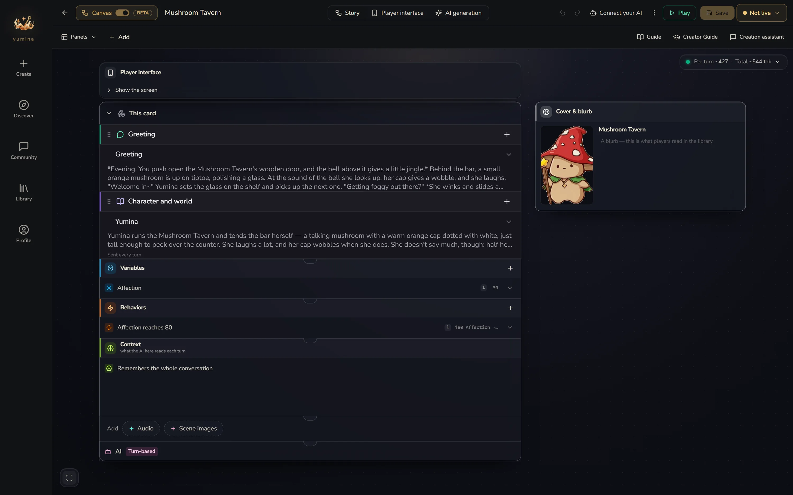

Later on you can add scenarios, a few more AIs and a player interface, and a card might grow into something like this. No rush. One thing at a time:

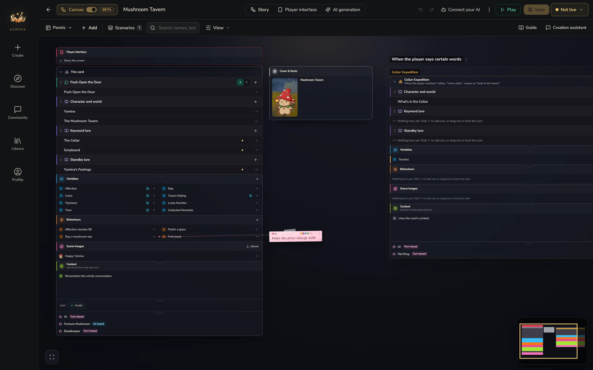

## On a phone

A phone screen can't fit the whole canvas, so phones get their own Studio. The switch in the top left is called **Studio** on a phone. Turn it on and the bar along the bottom reads **Assistant**, **Opening**, **Lore**, **Playtest** and **More**. The Creation assistant comes first and is what you see when you open it, because on a phone, typing "add some coins for me" to the assistant is often quicker than tapping around yourself.

You can edit openings, lore, variables and behaviours on a phone, and playtest too. Adding or editing AIs and dragging things into scenarios still needs the canvas on a computer.
