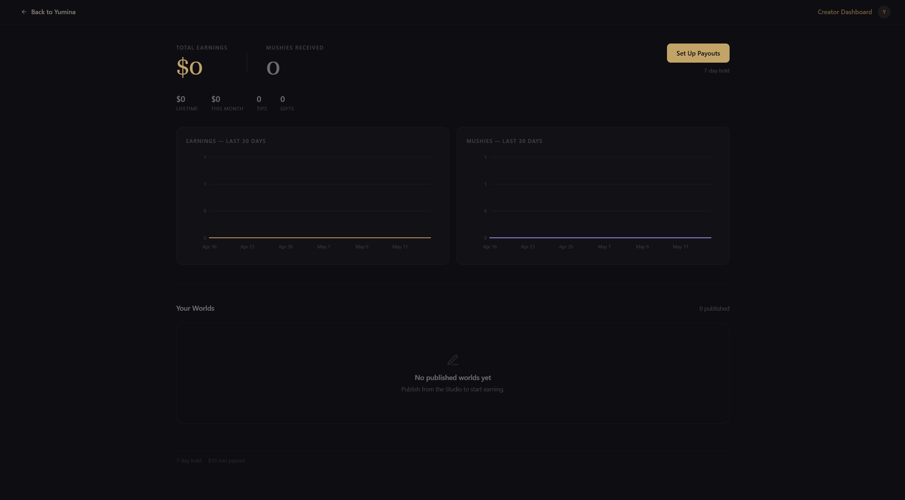

# Earnings & Payouts

Your **Creator Dashboard** — found under **Me → Creator Center** — is where you see how your worlds are doing (plays, players, favorites, messages) and where you cash out money tips from supporters.

## The hero

At the top of the dashboard you'll see two big numbers side by side:

- **Total Earnings** -- money tips you've received, including pending and available balance, in your local currency (USD-equivalent under the hood)
- **Mushies Received** -- the lifetime total of mushie gifts in your wallet

Below those, a stats row breaks down:

- **Lifetime** -- all-time money earnings
- **This Month** -- money earned this calendar month
- **Tips** -- count of money tips received
- **Gifts** -- count of mushie gifts received

To the right is the **Cash Out** button. If your Stripe Connect isn't set up yet, this becomes **Set Up Payouts** and walks you through onboarding.

## Charts

Two side-by-side charts sit under the hero:

- **Earnings — Last 30 Days** (gold) — daily total tip revenue
- **Mushies — Last 30 Days** (purple) — daily mushie gifts received

Both charts always render, even at zero, so you can see when things start picking up. Hover for per-day tooltips.

## Your Worlds

A grid of every published world you own. Each card shows:

- Thumbnail (with a gold earnings badge in the corner if that world has earned anything)
- Title
- Plays, favorites, messages, average rating

**Click any card** to drill into the per-world view.

## Per-world detail

Inside a world's detail view you get:

- **Four metric cards** -- Plays · Unique Players · Favorites · Messages (for the selected time window)
- **Extra stats row** -- Avg Session, Conversion (card views → plays), Card Views, Reviews
- **Charts** — one per metric, showing the daily trend

The **period picker** (top-right) toggles between 7 / 30 / 90 / 365 days. The 30-day default usually has enough signal without too much noise.

## Recent Support

Below the worlds grid, when you have any support history, a **Recent Support** section appears:

- A feed of recent tips and mushie gifts, with sender name (or "Anonymous"), amount, and any message the supporter left
- A **Top Supporters** column on the right -- your highest-cumulative supporters with avatars

Anonymous tips appear in the feed with the name "Anonymous" -- you get the amount and message, but not the identity.

## Stripe Connect & cash-out

To turn money tips into actual bank deposits, link a Stripe Connect Express account:

1. Click **Set Up Payouts** in the dashboard hero
2. Stripe walks you through identity verification (name, address, bank account, tax info as required by your country)
3. Your status switches to **Payouts active** once Stripe approves

Once active:

- The **Cash Out** button releases your available balance to Stripe, which pays out to your linked bank on its standard schedule
- The **Stripe Dashboard** link in the dashboard footer takes you to your Stripe Express dashboard for payout history, account updates, and tax forms

## Holds, fees, and minimums

| | Value |
|---|---|
| **Platform fee** | 20% of gross tip |
| **Stripe processing** | Deducted separately by Stripe per their pricing |
| **Hold period** | 7 days after each payment succeeds |
| **Minimum payout** | $10 |

Earnings start as **pending** for 7 days (refund/dispute window) and automatically roll into your **available balance** after. The hero shows pending and available separately when there's anything held.

## Mushie gifts

Mushies received from supporters are pure profit -- no platform fee, no Stripe processing, no hold. They land in your wallet instantly and you can spend them on anything that takes mushies (your own AI usage, paid models, etc.).

## Support entry in a fullscreen world

The play header carries a heart button players use to support you. A world with a **fullscreen custom UI covers that header** — so unless the world offers its own entry, its players have no way to reach the tip dialog at all.

If your world takes over the screen, have it call `api.openSupport()` from somewhere calm — a corner of the title or pause screen. It opens the same dialog with the same attribution to this world; you never handle payments yourself. See the [API reference](./advanced/08-api-reference).

Keep it small and never interrupt play with it. A support prompt shown mid-scene, or right after a player loses, converts worse than one sitting quietly on a menu.

## Tax

Stripe Express handles tax forms (1099-NEC for US, the equivalent for other regions) once your annual earnings cross the local reporting threshold. You can find the forms in your Stripe Dashboard. Yumina does not produce separate tax documents.

## See also

- [Publishing](./publishing) — how to publish a world so players can find and support it
- [Supporting Creators](/guide/06-supporting-creators) — the player-side of tipping, useful for understanding what your supporters see
