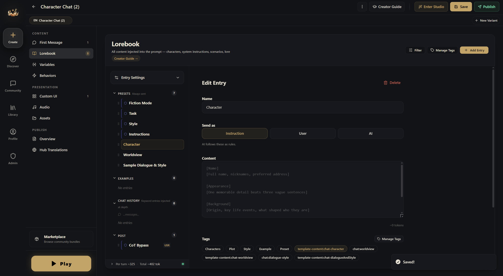
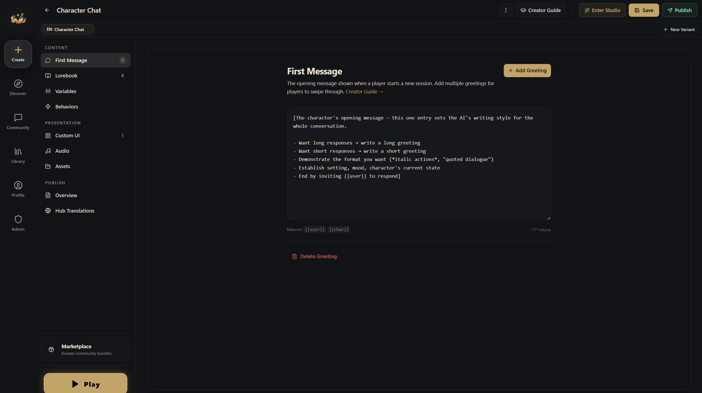

# Entries

Entries are what the AI sees each time it generates a reply — they can include character descriptions, world rules, lore, writing style, and more. Everything the AI fundamentally knows about your world comes from entries and variables.

In the editor, entries live in the **Lorebook** section.

## System Presets — Always On

Entries here are sent to the AI every single turn (it's best to keep everything in this section on Always Send (✿◡‿◡)). This is where you define your world's foundation:

- Character descriptions and personality
- World setting and rules
- Narrator instructions and writing style
- Game mechanics

For a survival horror game, the first entry might be a "Game Master Setup" that tells the AI its entire role:

> *You are a horror survival game GM. The game lasts 14 nights. Each night, describe a visitor knocking on the door. Give clues fairly without revealing their identity. End each reply with 3-5 suggested choices.*

That single entry defines what the AI is, what it does, and how it should respond. Everything else builds on top of it.

## Keyword-Triggered — Appears When Relevant

If you turn off Always Send, a keyword field appears for the entry. Keyword entries only activate when their keywords show up in recent messages. Use them for content the AI doesn't need to see every turn:

- NPC backstories (keywords: the NPC's name)
- Location details (keywords: place names)
- Specific mechanics (keywords: the actions that invoke them)

In the horror game, a "Peephole Observation" entry with keywords `peephole, peek, observe, look` only appears when the player tries to look through the door. It tells the AI to describe the visitor's face, teeth, eyes, and skin texture, with subtle flaws that hint at whether they're human or monster. When the player isn't looking through the peephole, this entry doesn't exist in the AI's context. Saves space, keeps focus.

**Keyword options:**
- **Primary keywords**: any single match triggers the entry ("tavern, inn, bar, drink")

## Post Instructions — Final Emphasis

Entries here appear after the entire conversation, right before the AI responds. Because they're the freshest thing in context, content here gets the most attention.

- Output format ("Always end with available actions")
- Style enforcement ("Write in second person, present tense")

## Send As — What Role This Entry Plays

Every entry has a **Send as** setting (in the editor pane: Instruction / User / AI) — it controls which role this entry takes in the AI's message sequence:

- **Instruction** (default) — sent to the AI as a system instruction (system role); the most common choice
- **User** — makes the entry look like the player said it (user role); useful for "borrowing" the player's voice to slip in background context
- **AI** — makes the entry look like a prior AI reply (assistant role); useful for shaping the AI's voice and continuity

Generally you won't need to touch this, since every AI model handles these a little differently.

## First Message

The first message is the opening scene players see when they start your world. In the editor, it has its own dedicated section: **First Message**.

Write the opening you want for the player. The AI reads the first message as part of the conversation history, so it strongly shapes the feel of the whole game (you can set up multiple first messages!):

> *The television flickers with static. An emergency broadcast repeats: "Confirmed Visitor characteristics: teeth that are unnaturally uniform and white. Residents are advised to avoid opening doors..."*
>
> *You're alone in the apartment. Bathroom, living room, bedroom, study, kitchen, storage room. A peephole on the front door. A handgun in the storage room. A few days of food in the fridge.*
>
> *Then comes the knocking.*
>
> *A young woman's voice, trembling: "Please... let me in... there's something out here chasing me..."*

## Macros

It sounds like a strange thing, but it just means entries support `{{macro}}` placeholders that get replaced at runtime — certain tokens are automatically swapped for the corresponding thing before the AI sees them:

| Macro | Replaced With |
|-------|--------------|
| `{{user}}` | Player's name |
| `{{char}}` | Character's name |
| `{{random::a::b::c}}` | Random pick from the options |
| `{{roll::2d6}}` | Dice roll result |
| `{{variableName}}` | Current value of that variable |

Any variable ID works as a macro. A variable called `location` becomes `{{location}}` in any entry.

## Best Practices

**Tell the AI what to do, not what not to do.** "Write vivid combat with sensory detail" works. "Don't write boring combat" doesn't.

**Keep entries concise.** The AI reads everything once per turn. Don't repeat the same content across different entries.

**Not everything needs to be always-on.** Move supplementary lore and NPC backstories to keyword-triggered. Lean entries are easier for the AI to handle.
