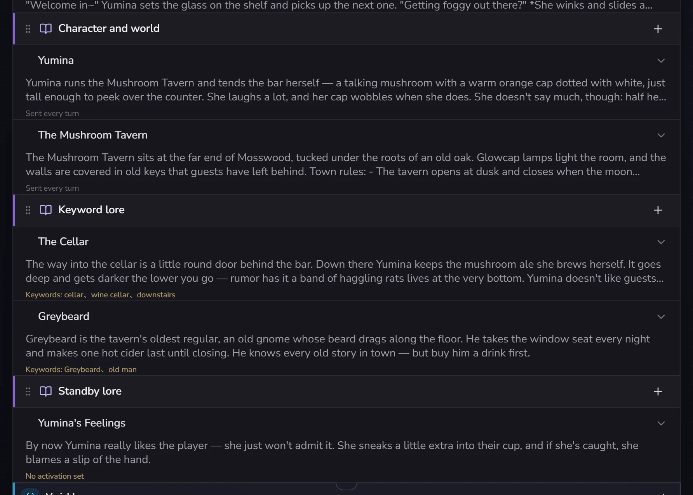
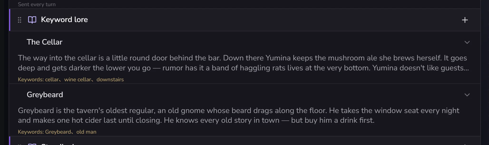
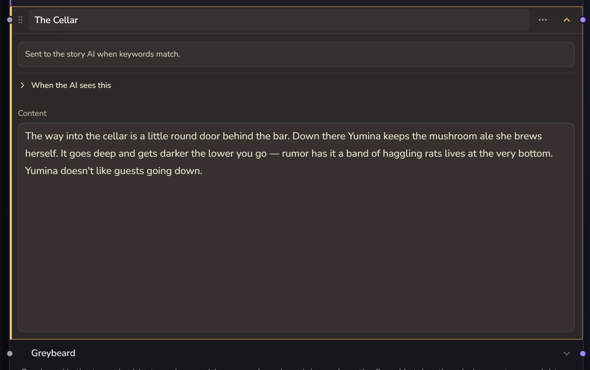
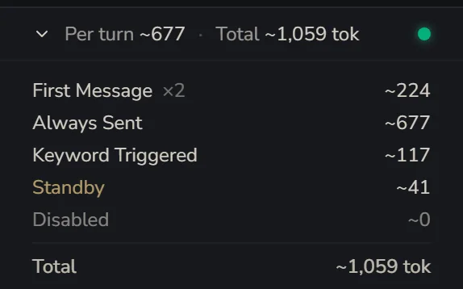

# Openings and Lore

## Openings

The opening is the first thing a player reads after opening your card. On the canvas, click the opening's row to write it.

The AI reads the opening as if it were earlier conversation, so it has a big effect on the style of the whole game. Write a long opening and the AI leans toward writing long. Use "*italic actions*" with "quoted dialogue" and the AI will follow suit. It's best to end with a hook, so the player knows what to say next.

> *The TV screen is nothing but static. An emergency broadcast plays on loop: "Confirmed visitor trait: teeth unusually straight and white. Residents should avoid opening their doors…"*
>
> *You're alone in your apartment. There's a peephole in the front door. There's a pistol in the storage closet.*
>
> *Then the knocking starts.*
>
> *A young woman's voice, trembling: "Please… let me in… something out here is chasing me…"*

**You can have several openings.** Click the ＋ in the top right of the opening block to add another, and players get to pick one when they start. Different openings can be different scenes, different storylines, even different starting values: drag an opening onto a variable and you can set "starting from this opening, Coins begin at 100". Drag it onto a [scenario](/creator/modules) and you get "this scenario only exists in games that start from this opening".

Openings can hold pictures or videos. Click **Insert image or video** in the top right of the text box. Details in [Visuals & audio](/creator/visuals-audio#pictures-in-the-opening).

## Lore

Lore (also called entries) is what the AI sees each turn when it writes a reply: who the characters are, what the world is like, what the rules are, what style to write in.

On the canvas, lore is split into four blocks by "when it's sent to the AI":

| Block | When it's sent |
|---|---|
| **Character and world** | Every turn |
| **Keyword lore** | Only when a certain word shows up in the recent conversation |
| **Conditional lore** | Only when a variable meets a condition |
| **Standby lore** | Never on its own. It waits for a behavior to open it |

Under each block's title you'll see how many entries it has and roughly how much text it costs per turn.

### Character and world: sent every turn

This is the foundation of your world: character descriptions and personalities, the setting, narration style, game mechanics.

Click a row in this block and it opens up. Name goes on top, content below:

In a survival horror game, for example, the first entry might be a "Game Master" entry that tells the AI its whole role:

> *You are the GM of a survival horror game. The game lasts 14 nights. Each night, describe a visitor knocking at the door. Give clues fairly but never reveal what they are. End every reply with 3-5 suggested options.*

One entry per character, one per place. Kept separate, they're harder for the AI to mix up.

### Keyword lore: sent when mentioned

For things the AI doesn't need every turn: an NPC's backstory (keyword: the NPC's name), details about a place (keyword: the place name), a particular mechanic.

In the horror game, a "Peephole" entry with the keywords `peephole, peek, look` only shows up when the player wants to look through the peephole. It tells the AI to describe the visitor's face, teeth, eyes and skin, with one small tell hinting at whether they're human or a monster. When the player isn't at the peephole, it stays out. That saves text and keeps the AI focused.

Separate keywords with commas. Any one of them showing up triggers it.

### Conditional lore: sent when a value gets there

For example, "Drunk descriptions" is only sent when `Tipsiness ≥ 5`. The quickest way to set it up is to drag the variable onto the entry on the canvas, then click the line to change the condition.

### Standby lore: waits for a behavior

Never sent on its own until some [behavior](/creator/automation) opens it. Say you have an entry called "Yumina's Feelings": normally the AI can't see it, but when affection reaches 80 a behavior opens it, and Yumina starts quietly caring about you. Use it for hidden storylines and switching between stages.

### Switching how it's sent

Every entry, once opened, has a **When the AI sees this** line. Click it to switch between the four kinds above, and the entry moves itself into the matching block.

### More settings

You usually won't need these:

- **Inject into**: which part of the AI's prompt it goes in. **Always sent to the AI**, **Sent when mentioned**, **Example dialogue**, **At the end**. "At the end" lore comes after the whole conversation, right before the AI replies. The AI pays it the most attention, so it's the place for final reminders like output format and style rules
- **Send as**: **Instruction** (default), **User** or **AI**. This decides whose voice the entry speaks in within the AI's messages. Every model handles this a bit differently, so it's usually best left alone
- **Secondary Keywords**, **Scan Depth**: fine-tuning for keyword lore

### See how much it all costs

The more lore you write, the more the AI has to read every turn. That costs more, and the AI gets worse at telling what matters. The canvas keeps a small bar in its top-right corner with the per-turn and total counts and a little dot; click it to open the breakdown. **Panels → Lorebook** shows the same numbers at the bottom left:

- **Per turn**: what gets sent every single turn, meaning the lore that's sent every turn
- **Total**: all your lore added up
- Open it to see the breakdown: **First Message** (sent once at the start; ×2 means you have two openings), **Always Sent** (every turn), **Keyword Triggered** (sent when a keyword comes up or a condition is met, so anywhere from 0 to this number per turn), **Standby** (never sent on its own, waits for a behavior to turn it on) and **Disabled**
- The little dot on the right watches the total: green under 30k, yellow up to 60k, red past that. Once it turns yellow, trim a bit. Is the same thing written in several entries? Are you writing a lot of "don't do this, don't do that"?

On the canvas, click **Context** to see what the AI actually reads this turn. See the Context section on the [AIs](/creator/ais) page.

## Macros

You can write `{{macros}}` in lore and openings. When the AI sees them, they're swapped for the matching thing:

| Macro | Becomes |
|-----|--------|
| `{{user}}` | The player's name |
| `{{char}}` | The character's name |
| `{{random::a::b::c}}` | One of the options, picked at random |
| `{{roll::2d6}}` | A dice roll result |
| `{{variable ID}}` | That variable's current value |

This takes the variable's **ID**, not its name, and the ID can only use English letters, digits and underscores. Variables made on the canvas get a random ID, so to use one in a macro, open its **Advanced**, change the **ID** to a short name like `location`, click **Apply**, then write `{{location}}` in your lore.

## Tips for Writing Good Lore

**Tell the AI what to do, not what not to do.** "Describe fights with rich sensory detail" works. "Don't write boring fights" doesn't.

**Keep it short.** The AI reads every active entry every turn, so don't repeat the same thing across entries.

**Not all lore needs to be sent every turn.** Move background knowledge and NPC backstories into keyword lore, and the AI will handle them better.
