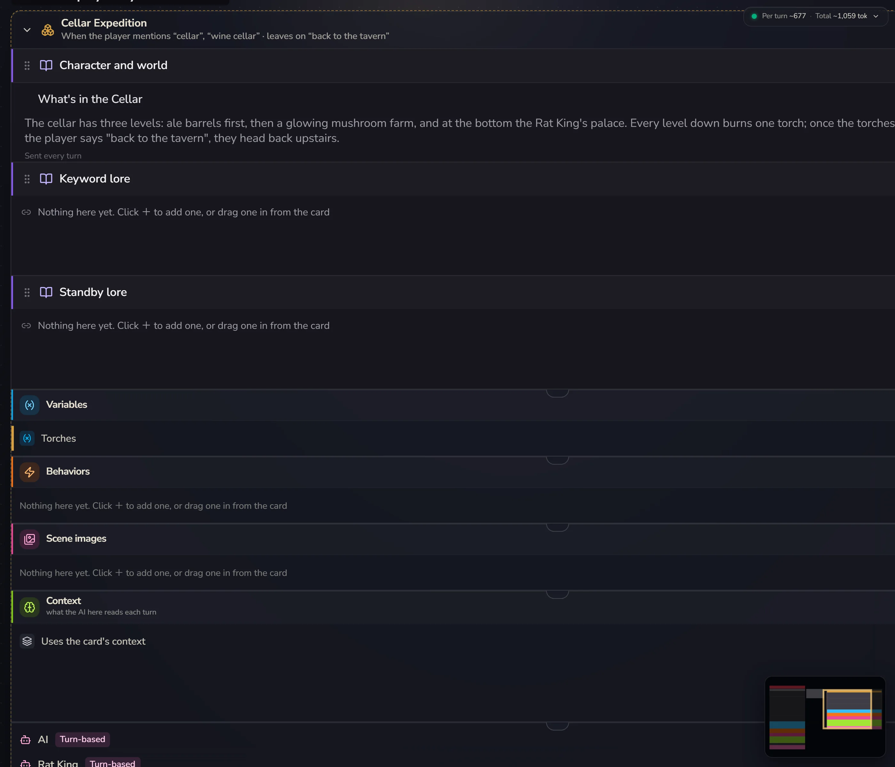
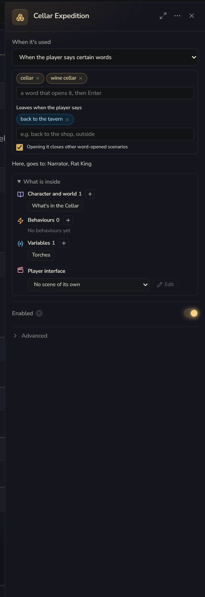

# Scenarios

A scenario is like another card inside your card: it has its own lore, variables, behaviours and memory, and it only applies at certain times. A dungeon, a chapter, a side story, an underground casino that only opens at night: any of these can be a scenario.

This used to be called a "knowledge base", then for a while a "module". On the canvas it's now always called a **Scenario**. The name has changed a few times, but the knowledge bases in your old cards are today's scenarios. You don't need to change a thing.



## What's on the card goes everywhere

Everything inside the "This card" frame in the middle of the canvas applies in every scenario. A scenario only needs to hold what's unique to it.

Say you're making an adventure game: the main world is a small town, plus three dungeons.

```
This card              world · hero · movement rules · Health
Dungeon A · Rustdeep Mine     what the mine is like · corrosion rules
Dungeon B · Bonewhite Steppe  what the steppe is like · body heat rules
Dungeon C · Misted Tower      what the tower is like · climbing rules
```

The world, the hero and Health go on the card, so you don't copy them three times. When the player walks into the mine, the AI gets "the card's + the mine's". When they walk out, the mine's part is put away. The "Health" all four places see is the same variable, and changing it anywhere changes it everywhere.

If you're writing inside a scenario and realise something should really apply everywhere, select it and click **Share with every scenario** in the floating bar. It goes back onto the card.

## Add a scenario

**Add → A scenario**. It appears next to the card. Click its title to open its settings.

There are two ways to put things in it:

- Select the scenario, then add things from **Add**. New things go straight into this scenario
- **Drag** a row from the card (or from another scenario) **into it**. With several rows selected, you can also click **Move to…** in the floating bar

Deleting a scenario doesn't delete what's inside. Those things go back onto the card.

## When it applies

**When it's used** in the scenario's settings:



| Option | Good for |
|---|---|
| Always | Always open. Handy for grouping and tidying |
| When entering from a chosen opening | Only exists in games started from certain openings |
| When a variable meets a condition | Opens only when, say, `location = mine` |
| When the player says certain words | Say "mine" and you're in |
| Only the Enabled switch | Never opens by itself. Waits for a behaviour to switch it with **Enable/disable scenario** |

The canvas groups scenarios next to the card by these options, so you can tell at a glance which ones split by opening and which ones you enter by keyword.

A few small details:

- A scenario opened by **certain words** can also have **Leaves when the player says**, like "back to town, go outside". Leave it empty and once you're in, it stays open. Tick **Opening it closes other word-opened scenarios** and you'll never be in the mine and on the steppe at the same time. This box only affects other scenarios that also have it ticked, so tick it on both the mine and the steppe.
- **When entering from a chosen opening** deserves a word of its own: it lets one card hold several completely different ways to play. In a game started from opening A, a whole scenario tied to opening B simply doesn't exist. It's not switched off. It just isn't there in that game at all. Dragging an opening onto a scenario is how you set this.
- **When a variable meets a condition** can also be set by dragging the variable onto the scenario. Once they're connected, click the line to change the condition.

## Memory

By default the whole card shares one memory: wherever you go, it remembers what happened before.

A scenario can keep its own. Choose under **Memory** in the scenario's settings:

- **Whole card** (default): reads the whole conversation
- **Its own pool**: while inside, the AI only sees what was said in this scenario. Walk into the tower and the AI has never heard of the town. Walk back out and the town still remembers what happened in the tower
- **Share this pool with**: A and B share one memory, C and D share another. Good for several scenes with the same NPC, or one side story

Whatever you pick, **messages never leave the conversation history**. All that changes is which part the AI in this place can see.

"Its own pool" is the key to endless-dungeon style games: every time you enter a dungeon, it's clean inside, untouched by the last run, while the world outside remembers everything (ง •̀_•́)ง

There's also **When the player leaves**:

- **Archive and summarise**: when they leave, this stretch is taken out of the AI's context and replaced with an automatic summary. The player's chat history doesn't lose a single word. You can write a line on "what to make sure the summary remembers", like "cause of death, clues found, favours owed". Coming back in starts a fresh round
- **Keep it**: this stretch stays in the context, like any other chat history

## AIs in a scenario

Every scenario has its own **Context** and **AI** rows at the bottom, just like the card. By default a scenario has no AI of its own. The card's AI keeps talking, it just also gets this scenario's lore and variables. That's what most scenarios should do.

If you want another AI to do the talking in a scenario, like a talking Rat King in the cellar, give that scenario an AI. That also lets you switch models and have it group-chat with the card's AI. All of this is covered on the [AIs](/creator/ais) page.

## Sticky notes and sharing

A scenario's settings have a **Sticky note** box for writing what the scenario is for, like "Health resets to zero when you leave this dungeon". It's for you and the Creation assistant. The AI running the game can't see it.

Made a scenario that works really well, like a fishing minigame? Click **Share this scenario** to save it into your bundles, so other cards can install it later.

## Most cards don't need scenarios

An ordinary character card doesn't need a single scenario.

Scenarios are worth it when:

- One card has several **places to go** (dungeons, chapters, a few side stories)
- One card has several **ways to start** (different openings that lead to completely different content)
- You want one part to **use a different AI, a different model, or forget everything**

If you just want to sort your lore into groups, folders are enough.
