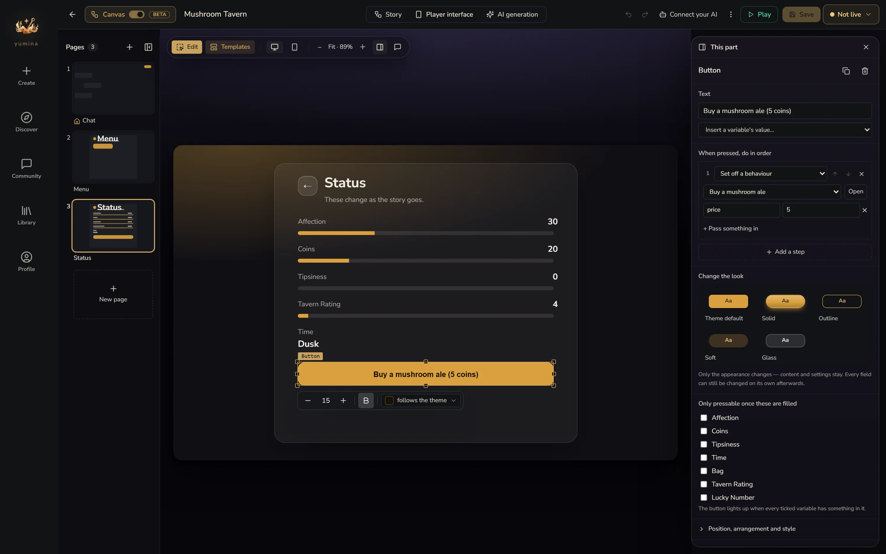
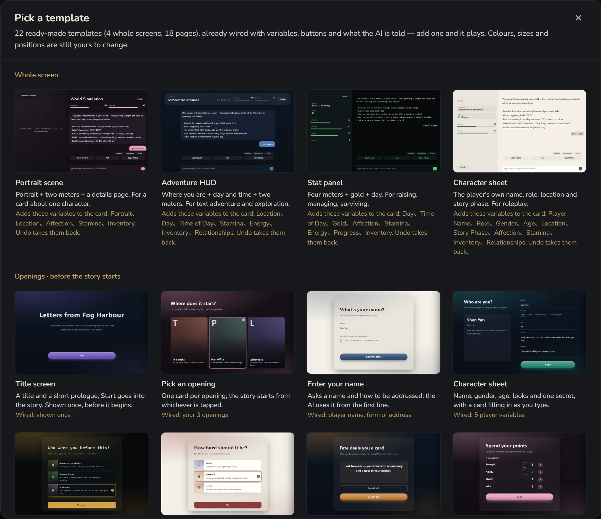
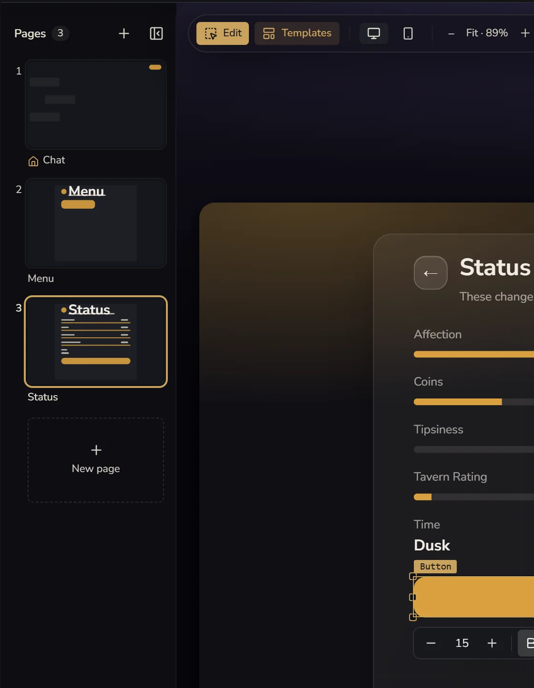
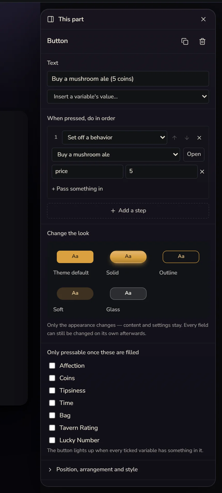

# Player Interface

The player interface is the screen players actually see while they play. It's totally fine to leave it alone. The default chat interface is clean and works well. If you want to give your card an opening page, a status panel, an inventory or a map, this is where you build them, **no code needed**.

There are two ways in: click **Player interface** in the middle of the top bar, or on the canvas, double-click the player interface preview stuck on top of "This card" (the pencil in its top right works too).

## Start from a template

Click **Templates** at the top to open **Pick a template**.

There are 22 ready-made templates, already wired up with variables, buttons and instructions for the AI. Add one and it plays.

**Whole screen**: swaps out the look of the whole card in one go

| Template | Good for |
|---|---|
| Portrait scene | A card about one character: portrait, two meters, a details page |
| Adventure HUD | Text adventure and exploration: current location, day and time, two meters |
| Stat panel | Raising, managing, surviving: four meters, gold, day |
| Character sheet | Roleplay: the player's own name, role, location and story phase |

Every whole-screen template tells you "Adds these variables to the card". Stat panel, for example, adds Day, Time of Day, Gold, Affection, Stamina… These are ordinary variables. Back on the canvas you can see them, change them, and drive them with behaviours. Don't want them? Just undo.

**Openings · before the story starts**: Title screen, Pick an opening, Enter your name, Character sheet, Pick a background, Pick a difficulty, Draw an opening, Spend attribute points, Confirm before starting. The player goes through these in order before the story begins, and what they pick is handed to the AI. Fill in a name, for instance, and the AI calls you by it from the very first line.

**While playing · opened from the chat page's Menu**: Status page, Inventory, Map, Phone messages, Relationships, Daily actions, Dice check, Clues and accusation, Collection.

There's also a **Blank page** with nothing on it, for laying things out yourself.

On the canvas, **Add → Opening pages, inventory, map…** and **A setup screen (name, cast, start)** open this same template library.

## Pages

The column on the left holds every page in the card, like slides:

- Click a page to edit it, drag to reorder, double-click to rename, right-click for duplicate, delete and so on
- **New page** also picks from the templates
- If a page has no button that leads away from it, it gets a **No way out** warning, so players don't get stuck
- On a card with only one page, this column starts folded away

## Edit right on the screen

While **Edit** at the top is on, click something on the screen to select it, drag it to move it, and pull a corner to resize it. Turn **Edit** off to press buttons like a player would and see what they do. This is a preview: it doesn't call the AI and doesn't cost credits.

**Desktop** and **Phone** switch the preview width. Each width has its own positions and sizes, and you're editing whichever one you're looking at. Some parts can be set to show **Desktop only** or **Phone only**.

Select a part and its settings appear on the right as **This part**:

- The text and what it shows: you can **Insert a variable's value…**, like "Day {current day}"
- **Position, arrangement and style**: colour, font size, alignment, rounded corners and so on
- **Add a part**: Text, Button, Image, Panel, Meter, List, Card picker, Form field, Popup
- **Layers**: every part on this page. Click a name to select it. The easiest way to find something hidden behind something else

With nothing selected, the right side lists what this page uses.

### How the conversation looks

The **Conversation** block in the middle and the input box below it are the heart of the card. You can't delete them, but you can change how they look. Select it, and **Message look** offers Platform, Bubbles, Novel, Letter and Terminal. Further down, **Fine-tune text, bubbles and special formats** lets you change the font and bubble colours separately, and even style special formats (like *italic* action lines).

## What buttons can do

Select a button, and under **When pressed, do in order** you can line up several steps:

- **Say a line for the player**: like "Look around". One click and it's as if the player said it
- **Change a variable**
- **Set off a behaviour**: you can **+ Pass something in**, see [Behaviours · Passing a value from a button](/creator/automation#passing-a-value-from-a-button)
- **Call an AI**: calls a UI-based [AI](/creator/ais), like a fortune teller
- **Switch opening**, **Go to page**, **Pick at random**
- **Show a notice**, **Play audio**, **Stop audio**
- **Regenerate**, **Undo last turn**

**Only pressable once these are filled**: tick a few variables, and the button only lights up once they all have something in them. The "Start" button on an opening page often uses this, so nobody gets in without a name.

**Change the look**: Theme default, Solid, Outline, Soft, Glass. Only the appearance changes, not the content.

## Writing your own interface code

When templates and parts aren't enough, you can build it all yourself. Interface code lives in **Panels → Front End Code**. Write it by hand, or have the Creation assistant write and edit it for you. Details in [Advanced: Custom UI Deep Dive](/creator/advanced/custom-ui-deep).

## When you're done

Once saved, this is the interface both playtests and players see. When you're done, click **←** in the top left to go back to the canvas.
