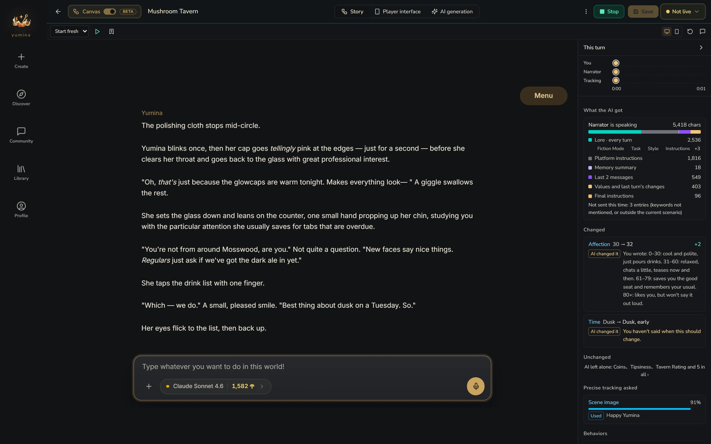
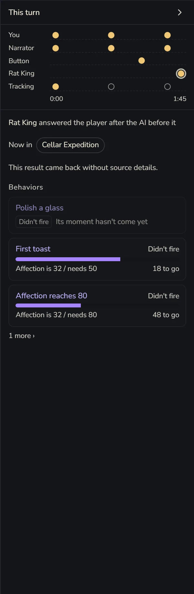
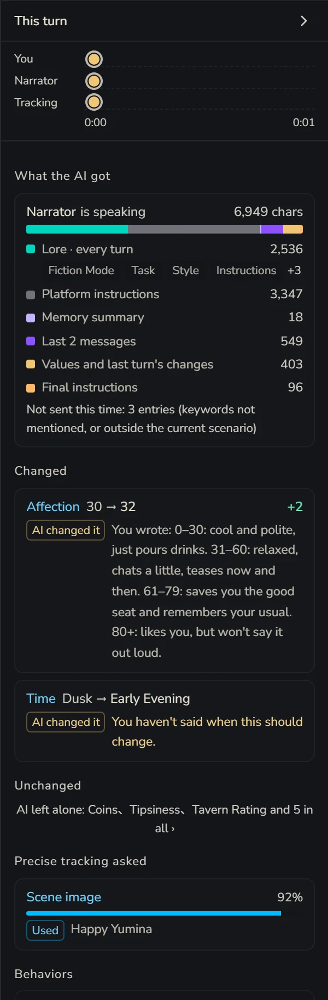
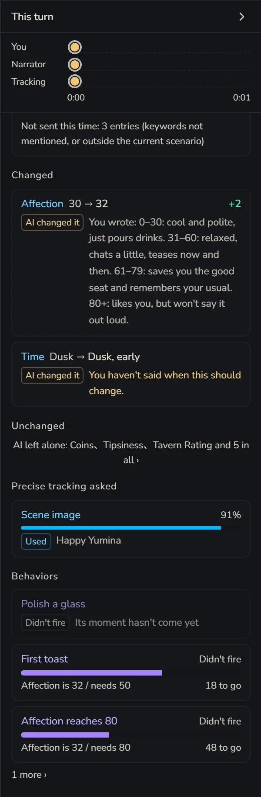

# Playtest

Click **Play** in the top bar (a new card needs to be saved once first). A playtest really starts a game with the model you picked, so it **uses up credits**. The right side writes out what happened behind every turn: what the AI got, why a number changed, why a behavior didn't run.

## Starting a game

The playtest takes over the whole screen. On the left is what the player sees, on the right is **This turn**. At the top you can switch between **Desktop preview** and **Mobile preview**.

If you change the card's settings mid-playtest, you'll see "Settings changed — restart the test to apply them". Just click **Restart**. To finish, click **Stop** in the top bar, or the ← in the top left to go back to the canvas.

### Playtest start

So you don't have to replay from the opening every time you test one scene, you can save the current state as a **Playtest start** when you reach a spot, and begin from there next time. Each card can keep up to 30.

## This turn

After you send a line, the right side writes out what happened on this turn.

### Timeline

At the top is a timeline with one lane per speaker: **You**, the card's AI, each scenario's AI, AIs that speak up when things go quiet, and **Precise tracking**. A filled dot means it spoke. A hollow dot means **Woken, stayed silent**. Click any dot to see the details of that call.

In a group chat, an AI that chimes in after another will say it **answered the player after the AI before it**.

### What the AI got

The prompt the AI actually received this turn, split into parts, each with its length: Lore · every turn, Lore · mentioned this turn, Memory summary, Handed over by other scenarios, Recent conversation, Values and last turn's changes, Final instructions…

At the very bottom is a line, **Not sent this time: N entries**. Those are entries whose keywords weren't mentioned, or that aren't in the current scenario. Whenever you're thinking "I definitely wrote that, so why doesn't the AI know?", check here first (｡•́︿•̀｡)

### Now in

Which scenarios are open right now, which one was **just entered** and which one was **just left**. Which AIs arrived and which left.

### Each value

Whether each variable **Changed** or stayed **Unchanged** this turn, and why:

- Changed: **AI changed it**, **Precise tracking** (with how confident it was), **Behavior**, **Button**, **Follow-on** (a formula variable recalculated from other numbers)
- Unchanged: **Blocked** (the AI tried to change it, but it's set so the AI can only read it, or Precise tracking is in charge of it), **Malformed** (the AI's directive was written wrong, so the old value stays), **AI left it**, **Behaviors only**

Precise tracking only changes a value when it's at least 80% sure. Below that, you'll see something like "thought it should become X, but was only 60% sure". If a number just won't move, this is often why.

Under each variable you'll also see the "when it changes" you wrote for it, so you can compare: did the AI not follow it, or was it never clear in the first place?

### Each behavior

**Fired** or **Didn't fire**. For the ones that didn't, it tells you what's missing:

- "Affection is 62 / needs 80, 18 to go, about 6 more turns at the recent pace"
- **Cooling down**, **Used up**, or the scenario it lives in isn't open right now
- Waiting for the player to say a keyword, waiting for a button press, or once every 5 turns with the next one on turn such-and-such

### Precise tracking asked

The questions the smart tracking helper was asked this turn: should a number change, should the music switch, should a scene image show, did a certain thing happen. Each answer comes with how confident it was, and whether it ended up **Used** or **Not applied**.

## Back on the canvas

Close the playtest and go back to the canvas, and the turn you just played leaves its marks there:

- Lore that was really sent to the AI this turn gets a **used** tag
- Scenarios are marked **Active** or **Dormant**
- Variables show their **Live** values, and behaviors show how far they are from firing

Change whatever you want right there, then hit Play again to keep going.

## When a reply fails

Read the notice first. Usually it's no model picked, not enough credits, or the model being too busy right now. If the connection dropped, click **Check conversation** first to see whether the reply actually arrived. Don't rush to send again, or you might get charged twice.
