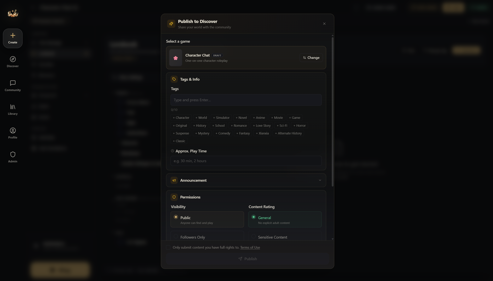

# Publishing

When your world is ready, publish it to the Hub so players can discover and play it.

## Before You Publish

- **Play test your world.** Send 10-20 messages. Check that variables update correctly, entries trigger at the right time, and that it actually plays well.
- **Write a good description.** This is the first thing players see on the Hub. Be clear about what the experience is — genre, tone, premise.
- **Add a cover image.** Worlds with cover images get noticeably more clicks.
- **Set the content mode.** Label honestly — **Limited** for standard content boundaries, **Limitless** for expanded content boundaries. Mislabelling is a guidelines violation.
- **Tag your world.** Tags help players find your world through search and filtering.

## How to Publish

1. Open your world in the editor
2. Go to the **Overview** section and fill in the description and cover image
3. Click **Publish** on the right of the editor's top bar (right next to **Save**)
4. In the publish dialog, set the content mode, visibility, and whether to allow others to edit; agree to the terms; hit Publish

Once it passes review, everyone can see it ( •̀ ω •́ )✧.

## Updating a Published World

After publishing, you can keep editing. Saved updates that need publishing appear as **Unpublished changes**. Saving a draft does not submit it for review or replace the live version. When you're ready to push those updates to players:

1. Make and save your changes
2. Open **Unpublished changes** in the editor's publishing status
3. Click **Submit for review**. The status becomes **In review** only after submission; the current version stays live until approval. Creators with review bypass enabled see **Publish update** instead, which publishes without waiting for admin review. Either action saves any additional unsaved edits before submitting them.

Existing players' sessions aren't affected — they continue with the world version they started with. New sessions use the updated version.

## Version History and Rollback

Open **Versions / Version history** from the editor's top bar or its **⋮** menu. Update and Publish save one version of the changed content, cover, and age rating. Repeating an unchanged update or publication reuses its matching automatic record. Approval marks that same saved version live, without adding a separate published copy. Saving, publishing, and switching the live version do not create an extra backup of the outgoing live content.

Each **Saved version** shows its status: **Not published**, **Currently live**, or **Previously published**. A world keeps up to **20 automatic records, including restore backups**, separately from **10 named versions**. Older automatic records are removed as the limit is reached. Manually named versions remain distinct even when their content matches an automatic version, and automatic history does not replace them.

- **Restore to draft:** select any saved version to replace your working content, cover, and age rating. The public version stays unchanged. Leave the safety-backup option checked to save your current draft first, then test and publish the restored draft when ready.
- **Make live:** on a currently published world, choose an eligible **Previously published** version to switch the public content, cover, and rating. **Currently live** identifies the active version. Your working draft is preserved. Existing history remains subject to the automatic-record limit.

Both actions keep listing details such as the title and tags unchanged. Only eligible, previously live versions offer **Make live**; named saves and versions that have never been published must be restored to a draft and published through the normal review process. The optional restore safety copy is labeled **Backup before restore**. Withdraw any pending update review before switching. If a world was taken down and approved again, versions from before that latest approval cannot be made live directly.

## Multi-Language Support

If your world works in multiple languages, you can create language variants:

Just below the title you'll see your current variant, and to the right you'll find **Create New Variant** — a variant can be a different version of the same card, or a whole new language!

The content entries themselves (character descriptions, lore, etc.) are part of the world schema — if you need content in a different language, create a separate world variant and link them through the language group system.

## Gallery Images

Add up to 8 gallery images showcasing your world — gameplay screenshots, custom UI, or promotional art. These appear on your world's Hub page.

## Announcements

Pin an announcement to your world's Hub page to communicate updates, events, or important information to players. Maximum 5,000 characters.
