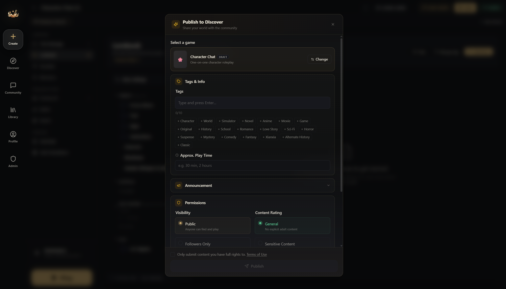

# Publishing

When your world is ready, publish it to the Hub so players can find it and play.

## Before You Publish

- **Playtest your world.** Send 10-20 messages. Check that variables update properly, entries kick in at the right moments, and that it's actually fun to play.
- **Write a good blurb.** It's the first thing players see on Discover. Be clear about what the experience is: genre, tone, premise.
- **Add a cover image.** Worlds with a cover get noticeably more clicks.
- **Set the content mode.** Label it honestly: **Limited** for standard content boundaries, **Limitless** for expanded content boundaries. Mislabelling breaks the community guidelines.
- **Tag your world.** Tags help players find your world through search and filters.

## How to Publish

1. On the canvas, click **Cover & blurb** on the right. Fill in the name and blurb, and upload both covers, portrait and landscape
2. Click **Not live** on the right of the top bar and choose to publish
3. Before publishing, it runs through a short checklist: a name, a cover, an opening, and at least one playtest
4. In the publish dialog, set the content mode, visibility, and whether others can edit; tick the terms; click Publish

Once it passes review, everyone gets to see it ( •̀ ω •́ )✧

### Lore Shift

The publish dialog also has a **Lore Shift** section. Players with the Lore Shift extension can change the lore and values you allow in their own game, like setting their coins to 999 or adding a new character. It only affects that player's own game. Your original card doesn't change.

- **Allow session editing**: the master switch. While it's off, nothing below it does anything
- **Allow new session lore**: lets players add new lore to their own game. It ranks below the lore you wrote
- Then tick **Players may edit this lore in a session** on the lore you want to open up, and **Players may edit this value in a session** on the variables you want to open up

Everything is off by default. If there's nothing you want players to touch, you don't have to do anything.

## Updating a Published World

You can keep editing after you publish. Your changes are first saved as "unpublished changes", and players still see the live version. When you're ready, open the publish menu in the top right and submit the update. You can add a short update note while you're at it, and once it passes review, it's sent to players who've played your card.

Players who already started a game aren't affected. They keep playing the version they started with. New games use the updated version.

## Version History and Rollback

On the canvas, open it from **Panels → Version History** (in the full editor it's in the top bar or the **⋮** menu). Updating and publishing save one version of the changed content, cover and age rating. Submitting unchanged content again reuses the matching automatic record. Once approved, that same saved version is marked as the live version, without making a separate published copy. Saving, publishing and switching the live version don't make an extra backup of the live content you're switching away from.

Each **Saved version** is marked **Not published**, **Currently live** or **Previously published**. Each world keeps up to **20 automatic records, including restore backups**, plus **10 manually named versions**. When automatic history hits its limit, older records are cleared out. Manually named versions are always kept separately. Even if their content matches an automatic version, automatic history won't replace them.

- **Restore to draft:** pick any saved version to replace the content, cover and age rating you're editing. The live version stays as it is. Leave "Save current state as a safety snapshot first" ticked to back up your current draft first. After restoring, playtest to check, then publish through the normal process.
- **Make live:** while your world is published, you can pick an eligible version marked **Previously published** to switch the content, cover and age rating everyone sees. **Currently live** marks the version in use. The draft you're editing is kept separately, and existing history still follows the automatic-record limit.

Neither action rolls back listing details like the title and tags. Only eligible versions that were actually live before offer **Make live**. Named versions and saved versions that were never published have to be restored to a draft first, then published through the normal review process. The optional restore safety copy is labelled **Backup before restore**. You must withdraw any update under review before switching. If a world was taken down and approved again, versions from before the latest approval can't be made live directly.

## Multi-Language Support

One card can have several versions, like a Chinese version and an English version, or different versions of the same story. On the canvas, open **Panels → Languages & variants**, or click **Cover & blurb**. The variants are right at the top, where you can switch between them or make a new language version.

Each variant is its own separate content: lore, openings and variables all need to be written again in that language. They're linked together through a language group, and players see the version in their own language on Discover.

## Gallery Images

Add up to 8 gallery images to show off your world, like gameplay screenshots, custom UI or promo art. They appear on your world's details page.

## Announcements

Pin an announcement to your world's details page to tell players about updates, events or other important news. Up to 5,000 characters.
