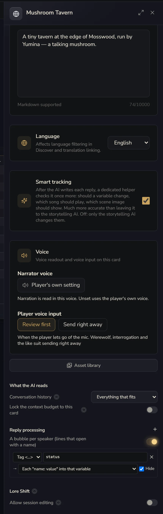

# Reply Processing

Lots of cards have the AI add a status line at the end of each reply, like this:

```text
…She slides the glass over to you and turns to see to the other guests.

<status>
Affection: 45
Time: Late night
Mood: A bit tired
</status>
```

**Reply processing** can pull that block out, write it into variables, and hide it from the story text the player sees, with no code.

On the canvas, click **Cover & blurb** on the right. **Card settings** opens on the right side. Scroll down and you'll find **Reply processing**.



## A rule

Each rule first says **what to catch**:

- **Tag <…>**: fill in `status` and it catches `<status>…</status>`. It also recognises `【status】…【/status】` and `[status]…[/status]`, so whichever one the AI writes is fine
- **Pattern**: if you know regular expressions, you can write your own. Whatever's in the first set of brackets is what gets caught

Then **where it goes once caught**. You can pick several:

- **Each "name: value" into that variable**: in the example above, `Affection: 45` gets written into the "Affection" variable. The variable has to exist first
- **A story event**: behaviors can listen for it. For example, if the AI writes `<ending>Good ending</ending>`, that sets off the ending behavior
- **An interface channel**: for your player interface code, which can subscribe to the channel
- Or **Nowhere**, just hidden

Last, whether to tick **Hide**: if ticked, that part disappears from the story text the player sees.

Remember to tell the AI to write it this way in your lore. For example, in an "At the end" entry, write "End every reply with a `<status>` block listing Affection, Time and Mood".

## One bubble per speaker

When several characters talk in the same reply, turn on **A bubble per speaker (lines that open with a name)** and the default chat interface splits it up, one bubble per character.

It looks for lines that start with a character's name:

```text
Shen Fei: You're back again.
【Alan】I'm just passing through.
**Shopkeeper**: What can I get you two?
```

The names have to match the names of characters in your card. Any text before the first name counts as narration and gets a bubble of its own. It only splits if it can make at least two bubbles. Otherwise it shows as usual.

::: tip How is this different from a group chat?
Here, **one AI** writes everyone's lines in one go, and they're only split up for display. A [group chat](/creator/ais#group-chat) is **several AIs**, each one a separate call with its own lore, model and memory. Most of the time this is enough, and it costs less. Use a group chat when each character needs their own lore and memory.
:::
