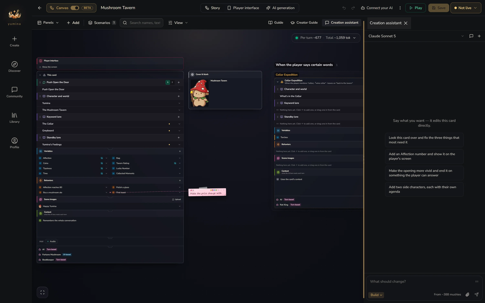
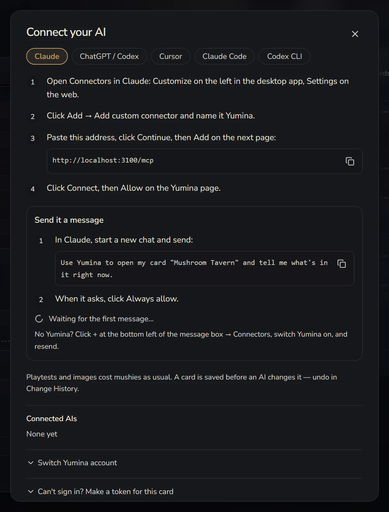

# The Creation Assistant and Your Own AI

You don't have to build a card by clicking through every box yourself. The canvas has a built-in **Creation assistant**, and you can also hook up the Claude, ChatGPT or Cursor you already use to edit your card.

## The Creation assistant

Click **Creation assistant** in the top right of the canvas and its chat opens on the right. Just tell it what you want. Casual is fine:

> "Add a sly merchant called Vex who talks in riddles and has trust issues"

> "Make a hunger system that drops over time. When it hits zero, the player dies"

> "Build a dark fantasy interface with health, mana and inventory slots"

> "Combat's too easy. Make enemies hit harder and add a wound system"

It can write lore and openings, add variables and behaviours, open scenarios, add AIs, build the player interface, check where things are wired wrong, and search the whole card. Its changes show up live on the canvas.

### Two modes

You can switch under the input box:

- **Plan**: for when you haven't decided what to make yet. It chats with you and helps shape your ideas into a **creative brief**, without touching the card
- **Build**: gets straight to editing the card. Once the brief is saved, click **Build it** and it builds a first version from the brief

### Changing only certain parts

First select the parts you want changed on the canvas (Ctrl + click to pick several), then talk to the assistant, and it focuses on just those. What you selected shows up as little tags above the input box.

Each part also has **Write this one for me**. One click asks the assistant to write just that part.

### Sticky notes

The assistant reads every [sticky note](/creator/canvas) on the canvas and knows what each one is stuck to. Too many ideas to explain at once? Stick them on as notes first, then tell it "go through the sticky notes and do all of these".

### If it breaks something

After each round of changes, a little strip called **The assistant's last turn** appears at the bottom of the canvas, saying how many things were added, changed and removed. Not happy? Click **Undo this turn** and the whole round is undone.

### Tips

- **One layer at a time.** Get the characters and lore right first, then add mechanics, then polish the interface last. Don't try to describe your whole world in one message
- **Ask it to check.** After a few rounds of changes, tell it "check whether anything is wired wrong right now"
- **It keeps working in the background.** Once you've sent a request, you can leave the Studio and do something else. It lets you know when it's done or when it needs you to confirm something
- Using the assistant costs credits. Before starting a big job, it tells you roughly how long it'll take and how much it'll cost

## Connect your own AI

If you'd rather use your own AI tools, you can let them sign in to your Yumina account directly and edit your cards. Supported: **Claude**, **ChatGPT / Codex**, **Cursor**, **Claude Code** and **Codex CLI**.

Click **Connect your AI** in the top bar (a new card needs to be saved once first), pick the one you use, and follow the steps. It goes roughly like this:

1. In your AI tool, add a connector / MCP server with the address `https://yumina.io/mcp`
2. It pops up a Yumina page for you to sign in. Click **Allow**
3. Back in the dialog, follow **Send it a message**: in Claude, for example, send "Use Yumina to open my card "Mushroom Tavern" and tell me what's in it right now". Once the dialog sees it's connected, it'll let you know (๑•̀ㅂ•́)و✧

Claude Code and Codex CLI are added in the terminal. The dialog gives you a command you can copy straight in.

Once connected, it can do about as much as the Creation assistant: read the card, write lore and variables, add behaviours and scenarios, change the player interface, generate pictures and playtest. Its changes show up live on the canvas you have open. It reads your sticky notes, too.

A few things to know:

- **It can't publish.** Publishing is always a click you make yourself
- **It saves a checkpoint before every change to your card.** In **⋮ → Change History** you'll see "Before: (the AI's name)". Not happy? Roll back to that moment
- **Playtests and image generation still cost your mushies**, same as if you clicked them on the canvas yourself
- There are a few limits to catch slip-ups: at most 30 playtest turns and 20 generated pictures an hour, and at most 20 new cards a day
- **Connected AIs** in the dialog lists everything that's connected. Click **Disconnect** to take the access back
- If signing in keeps failing, click **Can't sign in? Make a token for this card**. It makes a token that can only edit this one card and expires after 90 days. Put the address and header into your tool and you're set. The token is only shown once, so copy it right away

There's no way to do this on a phone yet. You'll need to connect from a computer.

## World Spec

If your AI tool doesn't support connectors, you can download the **World Spec** instead: a complete technical reference written for AIs to read. Have your AI read it, describe what you want so it writes the card's JSON, then import that into Yumina.

→ [Download the World Spec](/world-spec/)
