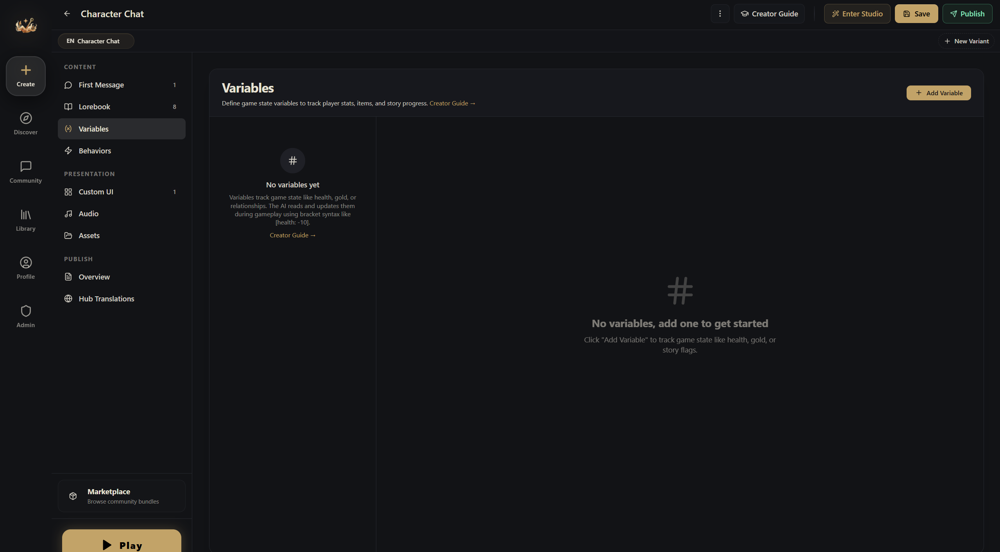

# Variables

Variables are your world's game state. Numbers, text, flags, complex objects — any data that needs to persist across turns. The AI reads them, updates them through directives, and your automation can react to changes.

::: tip Just describe the variable itself, in plain language
In a variable's **Behavior Rules**, you only need to spell out, in plain words, **what the variable is and when it should change**. **You don't need to mention syntax like `[health: -1]` — our engine has already taught the AI that part.**

✅ Write this: "Decreases when the player takes physical damage, scaled by severity. A punch -5 to -10, a sword slash -15 to -25. Recovers slowly when resting."
:::

In the editor, open the **Variables** section. Each variable has a name, type, default value, and Behavior Rules.

The horror world from the entries page uses 5 variables: health (number, 0-5), energy (number, 0-8), day count (number, 1-14), game phase (string, "Night" or "Day"), and armed status (boolean). That's enough to run a full 14-night survival game.

Each turn, the AI reads the current values, writes directives like `[health: -1]` in its reply, and the engine extracts them and updates the state.

## Variable Types

### Number

Tracks quantities: health, gold, affinity, day count, hunger.

You can set min/max bounds, and the engine clamps to range automatically.

### String

Tracks text state: location, mood, current quest, time of day.

### Boolean

Tracks true/false flags: has a key, met the NPC, triggered an event.

### JSON

Tracks complex structures: inventory arrays, NPC relationship objects, quest logs, map data.

JSON variables support **dot-path** updates — you can modify a nested field without rewriting the whole object.

## Behavior Rules — The Most Important Part

Behavior Rules are plain-language instructions that teach the AI **when and how** to change a variable. Without them, the AI won't reliably use your variables.

(In the editor this field is labeled **Behavior Rules**. We call it Behavior Rules here to keep it distinct from the automation system the editor calls **Behaviors**.)

### Good Behavior Rules

Variable: Health:

> This is the player's health. 0 = death — describe a death scene and end the game. 1-20 = critical (bleeding, difficulty breathing). 20-50 = wounded (pain affects actions). 50-80 = bruised (minor discomfort). 80-100 = healthy.
>
> Decrease on physical damage proportional to severity. A punch: -5 to -10. A sword slash: -15 to -25. A fall from height: -20 to -40. Recover slowly when resting (+5 per rest scene) or healing (+10 to +30). Never change by more than 30 in a single turn.

### Patterns That Work

**Numeric ranges** — define what each range means narratively:
> 0 = game over. 1-25 = desperate. 26-50 = struggling. 51-75 = capable. 76-100 = confident.

**Triggers** — when should this change:
> Increases when the player helps villagers, gives gifts, or protects them. Decreases on theft, threats, or broken promises.

**Limits** — prevent wild swings:
> Never change by more than 10 in one turn. Minimum 0, maximum 100.

::: tip
Two to four sentences is usually enough. If your Behavior Rules run longer than a short paragraph, it's time to trim. The AI is smart — give it the concept and the boundaries, not a 500-word essay.
:::

## AI Access & Activation

By default every variable is fully exposed: the AI sees it each turn and may update it. Two per-variable controls change that — use them instead of writing "never touch this" into Behavior Rules, because the engine enforces them.

**AI access** — three tiers:

| Tier | The AI sees it | The AI can change it | Use for |
|------|----------------|----------------------|---------|
| AI can read & write (default) | ✓ | ✓ | State only the AI can judge: affinity, mood |
| AI read-only | ✓ (marked read-only) | ✗ — its directives are dropped | Engine-owned state the AI narrates: phase, rating, settlement results |
| Engine only | ✗ | ✗ | Ledgers, counters, bookkeeping — still drives conditions, Behaviors and custom UI |

A good rule of thumb: **the AI should only write what only the AI can judge.** Mechanics — phase machines, settlement math, reward ledgers — belong to Behaviors, with their variables set to read-only or engine-only. Bonus: engine-only variables cost zero prompt tokens.

**Activation** — when the variable is "in play":

- **Always** (default).
- **Manual** — an on/off gate. Set the starting state in the editor; flip it at runtime from a Behavior with a THEN effect on `@vars.enabled.<id>` (true/false).
- **Conditions** — active only while variable conditions match. Comparing against another variable works, and so does self-gating ("show rage only while it's above 0").
- **Openings** — active only in sessions started from the openings you check. The clean way to give each route its own variable set.

An inactive variable leaves the AI's game state and the player UI and rejects AI writes — **but it keeps its value.** Conditions, Behaviors and custom UI still read it, and re-activating simply re-exposes it. If you also want it reset, have a Behavior set it explicitly.
