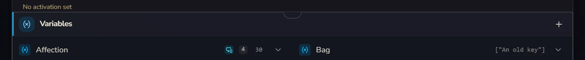
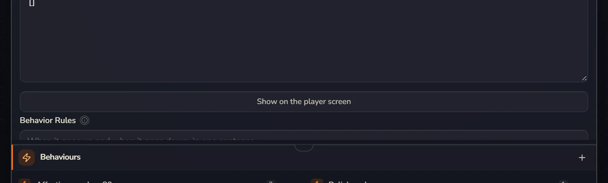

# Variables

Variables are the things your story needs to remember: affection, health, coins, where you are, what's in your bag. The AI sees them every turn and changes them as the story goes. Behaviours can react when they change. The player interface can show them on screen.

::: tip Just describe the variable itself, in plain language
In a variable's Behavior Rules, all you need to say in plain words is **what the variable is and when it should change**. No need to mention syntax like `[health: -1]`. Our engine has already taught the AI that part.

✅ Write this: "Drops when the player takes physical damage, scaled by how bad it is. A punch is -5 to -10, a knife wound -15 to -25. Recovers slowly when resting."
:::

## Add a variable

Click **＋ Variable** in the **Add** row at the bottom of the card (or **Add → A number that changes** in the toolbar):

A **Variables** block appears in the card, with the new variable's settings already open:

Change the name, pick a type, fill in the starting value and range, then write the **Behavior Rules**. Want the player to see it on screen? Click **Show on the player screen**.

Further down, three more sections are folded away: **Formula (worked out automatically)**, **What the AI does with it** and **Advanced**. We'll get to those.

To change it later, click it twice in the Variables block and it opens again. Once you have lots of variables, the block shows them one per row:

## Four kinds of variables

| On the canvas | Use it for |
|---|---|
| **Number** | Numbers you add and subtract: health 100, affection 20, coins |
| **Text** | A bit of text: current location, mood, time of day |
| **Switch** | Yes or no: has the key or not, has met someone or not |
| **List / table** | A group of things: inventory, relationships, a quest log |

Numbers can have a minimum and maximum, and the engine keeps them in range, so you'll never see -30 health. A list / table lets you change just one small piece of it, like the durability of the first weapon in the bag, without rewriting the whole thing.

## Behavior Rules (the most important part)

This is the **Behavior Rules** box in an open variable: plain words that teach the AI **when and how** to change it. Leave it empty and the AI pretty much won't use the variable properly.

(The editor calls this box "Behavior Rules". It's a different thing from the automation on the canvas called "behaviours". Don't mix them up!)

### Good Behavior Rules

Variable: Health

> This is the player's health. 0 = death: describe a death scene and end the game. 1-20 = critical (bleeding, struggling to breathe). 20-50 = wounded (pain gets in the way). 50-80 = scraped up. 80-100 = healthy.
> Drops on physical damage according to how bad it is. A punch: -5 to -10. A knife wound: -15 to -25. A fall from a height: -20 to -40. Recovers slowly when resting (+5 each time), +10 to +30 when healed. Never changes by more than 30 in one turn.

### Patterns that work

**Number ranges**: what each range looks like in the story
> 0 = game over. 1-25 = desperate. 26-50 = struggling. 51-75 = getting by. 76-100 = confident.

**When it changes**
> Goes up when the player helps villagers, gives gifts or protects them. Goes down on theft, threats or broken promises.

**By how much**
> Never changes by more than 10 in one turn.

::: tip
Two to four sentences is usually enough. If your Behavior Rules run longer than a short paragraph, it's time to trim. The AI is smart. Give it the idea and the limits, not a 500-word essay.
:::

## Precise tracking

Number and text variables can turn on **Precise tracking** (the canvas gives them a little "precise" tag). With it on, the story-writing AI stops changing the variable as it goes. Instead, a dedicated little helper rereads the latest scene every turn and decides whether it should change, and by how much. That's far more accurate and steady than having the story AI change it mid-sentence.

When you turn on Precise tracking for a number, fill in **Most it can rise per turn** and **Most it can fall per turn**. Say you set both to 10: a compliment is +3, a gift is +8, snapping at her is -10, and affection never jumps around wildly. For a text variable, it only ever picks one of the options you give it.

Numbers with a huge combined range (like losing 500 health in one turn) don't support Precise tracking.

## Formulas

Some numbers shouldn't be up to the AI at all. They should be worked out from other numbers, like "attack = base attack × (1 + level × 0.1)".

Fill in **Formula (worked out automatically)** in the variable's settings, for example `base_attack * (1 + level * 0.1)`. From then on, whenever another variable changes, it recalculates itself. The AI can see it but can't change it. You can use + - × ÷, comparisons, and `min`, `max`, `round`, `floor`, `ceil`, `abs`, `clamp` and `if`. If a variable name has a space or a hyphen in it, wrap it in `{}`, like `{max-health}`.

## Kept across playthroughs

Tick **Kept across playthroughs (for this player)** under **What the AI does with it**, and the variable follows the player instead of the game. When the player starts a new game, it picks up from the value they left it at.

Good for: how many times they've finished, endings they've unlocked, CGs they've collected, options that only show up on a second run. Works best paired with [moments](/creator/automation#moments) in behaviours.

## What the AI does with it

Open **What the AI does with it**. The **AI access** setting inside decides whether the AI can see it and whether it can change it. By default it can do both. **Use this instead of writing "AI, don't touch this" in the Behavior Rules**, because the engine enforces it:

| Setting | The AI sees it | The AI can change it | Good for |
|------|-----------|-----------|------|
| AI can read & write (default) | ✓ | ✓ | Things only the AI can judge: affection, mood |
| AI read-only | ✓ | ✗ | Things a behaviour or the interface changes while the AI just plays along: stage, rating |
| Engine only (hidden from AI) | ✗ | ✗ | Ledgers, counters and other internal bookkeeping. Costs the AI no text |

A handy rule of thumb: **only let the AI write things that only the AI can judge.** Arithmetic, stage changes and reward bookkeeping belong to behaviours.

## When the AI can see it

Open **What the AI does with it** and look for **When the AI can see it**:

- **Always** (default)
- **Manual**: a switch that behaviours turn on and off
- **Conditions**: it only shows up when a condition holds, like "Rage only shows when it's above 0"
- **Openings**: it only shows up in games that started from certain openings

While it's not showing, the variable stays out of the AI's prompt, doesn't appear on the player interface, and the AI can't change it. **But the value is kept the whole time**, and behaviours and the interface can still read it.

You can also put a variable inside a [scenario](/creator/modules). Then it only shows up while that scenario is open.

## Letting players change it (Lore Shift)

Players with the Lore Shift extension can change lore and values in their own game. For that, you first turn on **Allow session editing** in Card settings, then turn on **Players may edit this value in a session** under **Advanced** for each variable you want to open up. It only affects that player's own game. Your original card doesn't change. Everything is off by default.

**Try not to have too many variables, either.** Every variable takes up a line of the AI's attention every turn. Adding one you won't really use just wastes that attention.
